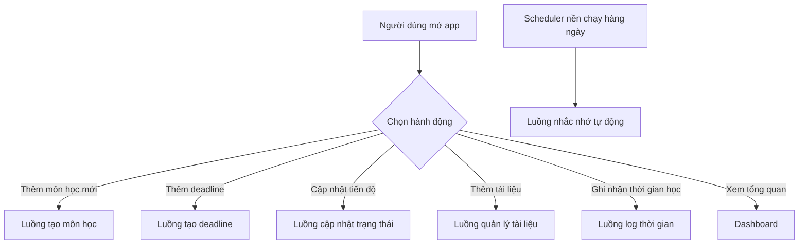
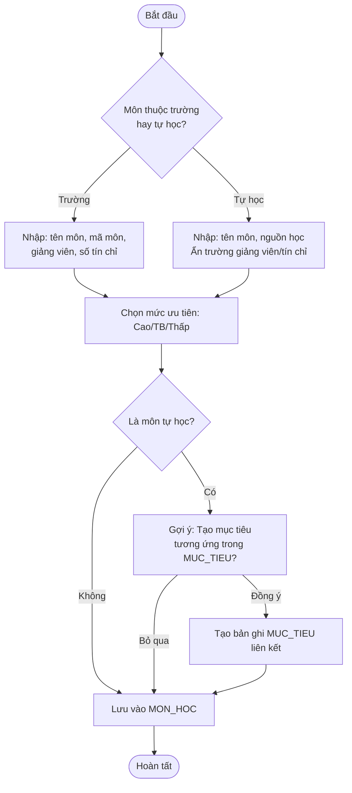
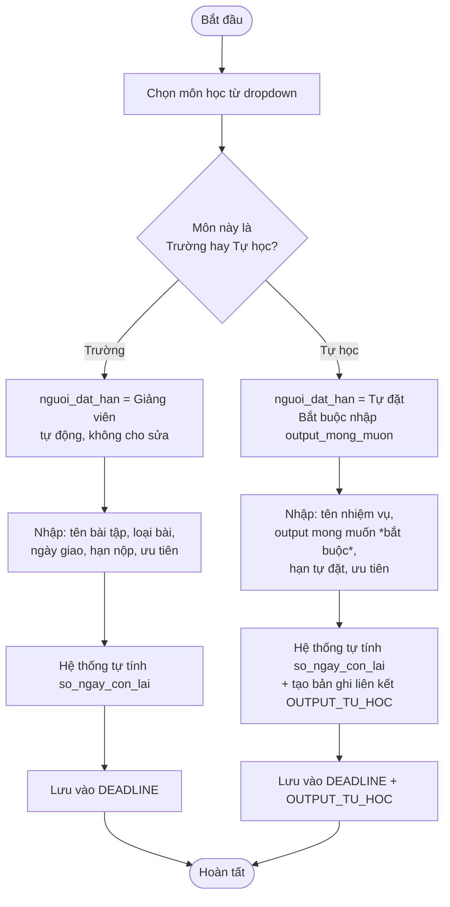
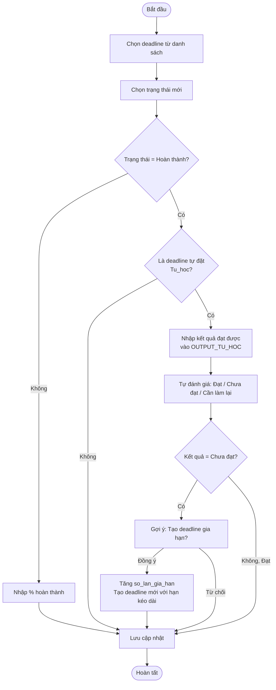
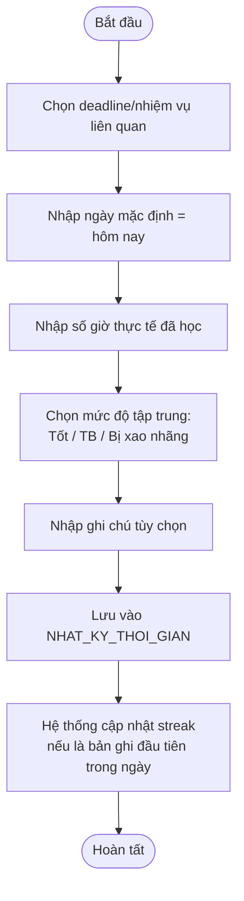
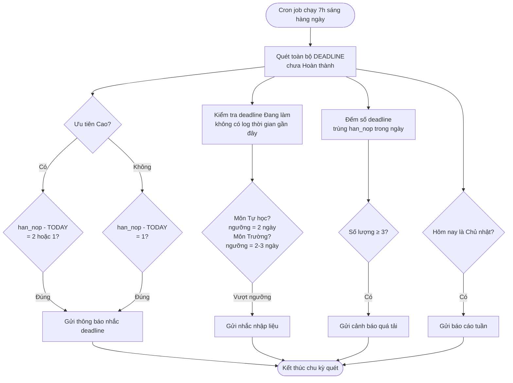
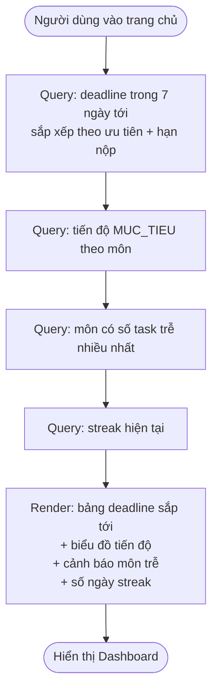

# ĐẶC TẢ LUỒNG HOẠT ĐỘNG (WORKFLOW)
## Hệ thống Quản lý Học tập & Deadline Cá nhân

---

## 1. Luồng tổng thể hệ thống (High-level flow)

---

## 2. Luồng 1 — Tạo môn học (phân nhánh Trường / Tự học)

**Điểm quyết định quan trọng:**
- Nếu chọn "Tự học" → form ẩn ngay các trường giảng viên/tín chỉ, hiện trường "Nguồn học"
- Hệ thống luôn hỏi có muốn gắn mục tiêu lớn hơn không (không bắt buộc)

---

## 3. Luồng 2 — Tạo Deadline (phân nhánh theo nguồn giao)

---

## 4. Luồng 3 — Cập nhật trạng thái & Output (bao gồm gia hạn)

**Lưu ý tâm lý:** Khi deadline tự đặt bị "Trễ hạn", hệ thống hiển thị cảnh báo màu **vàng** (nhắc nhẹ), KHÔNG dùng màu đỏ như deadline trường — tránh tạo áp lực/cảm giác thất bại không cần thiết.

---

## 5. Luồng 4 — Ghi nhận thời gian học thực tế

---

## 6. Luồng 5 — Scheduler nhắc nhở tự động (chạy nền hàng ngày)

---

## 7. Luồng 6 — Xem Dashboard

---

## 8. Bảng tổng hợp Trigger — Điều kiện — Hành động (cho Scheduler)

| Trigger | Điều kiện | Hành động | Tần suất |
|---|---|---|---|
| Nhắc deadline ưu tiên Cao | `han_nop - TODAY() ∈ {1,2}` và chưa hoàn thành | Gửi thông báo | Hàng ngày |
| Nhắc deadline ưu tiên TB/Thấp | `han_nop - TODAY() = 1` và chưa hoàn thành | Gửi thông báo | Hàng ngày |
| Nhắc nhập liệu (môn trường) | Không có log 2–3 ngày, trạng thái "Đang làm" | Gửi nhắc nhở | Hàng ngày |
| Nhắc nhập liệu (môn tự học) | Không có log 2 ngày | Gửi nhắc nhở (tần suất dày hơn) | Hàng ngày |
| Cảnh báo quá tải | ≥ 3 deadline cùng `han_nop`, chưa hoàn thành | Cảnh báo sớm | Hàng ngày |
| Báo cáo tuần | Ngày = Chủ nhật | Tổng kết tuần | Hàng tuần |
| Nhắc ôn tập (spaced repetition) | Tài liệu đã thêm 1/3/7 ngày | Gợi ý ôn lại | Hàng ngày |
