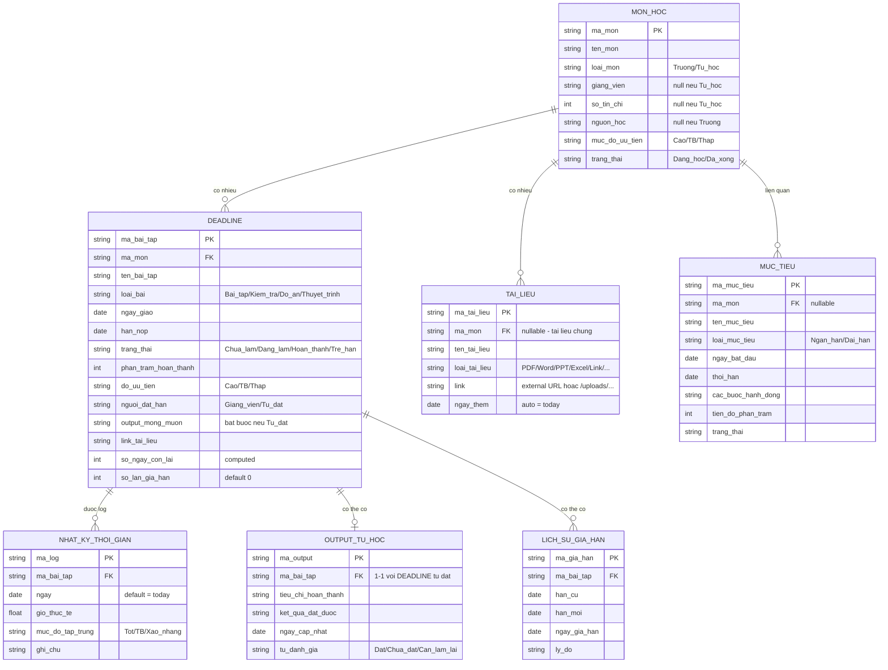

# THIẾT KẾ ERD CHI TIẾT
## Hệ thống Quản lý Học tập & Deadline Cá nhân

---

## 1. Sơ đồ ERD tổng thể



---

## 2. Chi tiết từng bảng

### 2.1. Bảng `MON_HOC` (bảng trung tâm)

| Trường | Kiểu dữ liệu | Ràng buộc | Ghi chú |
|---|---|---|---|
| `ma_mon` | VARCHAR(20) | PK, NOT NULL | Quy tắc: `TOA101`, `TUHOC-IELTS` |
| `ten_mon` | VARCHAR(200) | NOT NULL | |
| `loai_mon` | ENUM | NOT NULL | `Truong` \| `Tu_hoc` |
| `giang_vien` | VARCHAR(100) | NULL cho phép | Bắt buộc nếu `loai_mon = Truong` |
| `so_tin_chi` | INT | NULL cho phép | Bắt buộc nếu `loai_mon = Truong` |
| `nguon_hoc` | VARCHAR(200) | NULL cho phép | Bắt buộc nếu `loai_mon = Tu_hoc` |
| `muc_do_uu_tien` | ENUM | NOT NULL | `Cao` \| `Trung_binh` \| `Thap` |
| `trang_thai` | ENUM | Default `Dang_hoc` | `Dang_hoc` \| `Da_xong` (soft-delete) |

**Validation logic (tại tầng ứng dụng, không phải DB constraint):**
```
IF loai_mon = "Truong" THEN giang_vien, so_tin_chi bắt buộc
IF loai_mon = "Tu_hoc" THEN nguon_hoc bắt buộc
```

---

### 2.2. Bảng `DEADLINE`

| Trường | Kiểu dữ liệu | Ràng buộc | Ghi chú |
|---|---|---|---|
| `ma_bai_tap` | VARCHAR(30) | PK | VD: `TOA101-BT03` |
| `ma_mon` | VARCHAR(20) | FK → MON_HOC | |
| `ten_bai_tap` | VARCHAR(200) | NOT NULL | |
| `loai_bai` | ENUM | NOT NULL | `Bai_tap`\|`Kiem_tra`\|`Do_an`\|`Thuyet_trinh` |
| `ngay_giao` | DATE | | |
| `han_nop` | DATE | NOT NULL | |
| `trang_thai` | ENUM | Default `Chua_lam` | `Chua_lam`\|`Dang_lam`\|`Hoan_thanh`\|`Tre_han` |
| `phan_tram_hoan_thanh` | INT (0-100) | Default 0 | |
| `do_uu_tien` | ENUM | NOT NULL | `Cao`\|`Trung_binh`\|`Thap` |
| `nguoi_dat_han` | ENUM | NOT NULL | `Giang_vien`\|`Tu_dat` — **auto set** theo `loai_mon` của môn liên kết |
| `output_mong_muon` | TEXT | Bắt buộc nếu `nguoi_dat_han = Tu_dat` | |
| `link_tai_lieu` | VARCHAR(500) | | URL bài nộp |
| `so_ngay_con_lai` | INT | **Computed field** | `= han_nop - TODAY()`, không lưu tay |
| `so_lan_gia_han` | INT | Default 0 | Tăng khi có bản ghi trong `LICH_SU_GIA_HAN` |

---

### 2.3. Bảng `OUTPUT_TU_HOC` (chỉ áp dụng deadline tự đặt)

| Trường | Kiểu dữ liệu | Ràng buộc | Ghi chú |
|---|---|---|---|
| `ma_output` | VARCHAR(30) | PK | |
| `ma_bai_tap` | VARCHAR(30) | FK → DEADLINE, quan hệ 1-1 | Chỉ tồn tại khi deadline có `nguoi_dat_han = Tu_dat` |
| `tieu_chi_hoan_thanh` | TEXT | NOT NULL | VD: "Điểm ≥ 80/100" |
| `ket_qua_dat_duoc` | TEXT | | Cập nhật khi hoàn thành |
| `ngay_cap_nhat` | DATE | Default today | |
| `tu_danh_gia` | ENUM | | `Dat`\|`Chua_dat`\|`Can_lam_lai` |

---

### 2.4. Bảng `LICH_SU_GIA_HAN` (bảng mới — tách riêng để audit)

| Trường | Kiểu dữ liệu | Ràng buộc | Ghi chú |
|---|---|---|---|
| `ma_gia_han` | VARCHAR(30) | PK | |
| `ma_bai_tap` | VARCHAR(30) | FK → DEADLINE | |
| `han_cu` | DATE | NOT NULL | |
| `han_moi` | DATE | NOT NULL | |
| `ngay_gia_han` | DATE | Default today | |
| `ly_do` | TEXT | Tùy chọn | |

> Bảng này giúp bạn tự phân tích: mình hay trễ hẹn với bản thân ở loại deadline/môn nào để điều chỉnh cách đặt mục tiêu.

---

### 2.5. Bảng `TAI_LIEU`

| Trường | Kiểu dữ liệu | Ràng buộc |
|---|---|---|
| `ma_tai_lieu` | VARCHAR(30) | PK |
| `ma_mon` | VARCHAR(20) | FK → MON_HOC, nullable cho tài liệu chung |
| `ten_tai_lieu` | VARCHAR(200) | NOT NULL |
| `loai_tai_lieu` | VARCHAR(30) | Slide\|PDF\|Word\|PowerPoint\|Excel\|Link\|... |
| `link` | VARCHAR(500) | URL `http(s)` hoặc đường dẫn tệp app quản lý `/uploads/...`; có thể để trống |
| `ngay_them` | DATE | Auto = today |

---

### 2.6. Bảng `MUC_TIEU`

| Trường | Kiểu dữ liệu | Ràng buộc |
|---|---|---|
| `ma_muc_tieu` | VARCHAR(30) | PK |
| `ma_mon` | VARCHAR(20) | FK → MON_HOC, **nullable** (mục tiêu có thể không gắn môn cụ thể, VD "Đạt GPA 3.5") |
| `ten_muc_tieu` | VARCHAR(300) | NOT NULL |
| `loai_muc_tieu` | ENUM | `Ngan_han`\|`Dai_han` |
| `ngay_bat_dau` | DATE | |
| `thoi_han` | DATE | |
| `cac_buoc_hanh_dong` | TEXT | |
| `tien_do_phan_tram` | INT (0-100) | |
| `trang_thai` | ENUM | |

---

### 2.7. Bảng `NHAT_KY_THOI_GIAN`

| Trường | Kiểu dữ liệu | Ràng buộc |
|---|---|---|
| `ma_log` | VARCHAR(30) | PK |
| `ma_bai_tap` | VARCHAR(30) | FK → DEADLINE |
| `ngay` | DATE | Default today |
| `gio_thuc_te` | FLOAT | Cho phép số lẻ (VD 1.5) |
| `muc_do_tap_trung` | ENUM | `Tot`\|`Trung_binh`\|`Xao_nhang` |
| `ghi_chu` | TEXT | Tùy chọn |

---

## 3. Quy tắc đặt khóa (Key Naming Convention)

| Bảng | Format mã | Ví dụ |
|---|---|---|
| MON_HOC | `[LOẠI][SỐ]` hoặc `TUHOC-[TÊN VIẾT TẮT]` | `TOA101`, `TUHOC-IELTS` |
| DEADLINE | `[ma_mon]-BT[STT]` | `TOA101-BT03`, `TUHOC-IELTS-NV01` |
| TAI_LIEU | `[ma_mon]-TL[STT]` | `TOA101-TL01` |
| OUTPUT_TU_HOC | `[ma_bai_tap]-OUT` | `TUHOC-IELTS-NV01-OUT` |
| NHAT_KY_THOI_GIAN | `LOG[timestamp]` | Tự sinh, không cần người dùng thấy |
| LICH_SU_GIA_HAN | `GH[timestamp]` | Tự sinh |

---

## 4. Ràng buộc toàn vẹn dữ liệu quan trọng (Business Rules)

1. `output_mong_muon` trong DEADLINE **bắt buộc NOT NULL** khi `nguoi_dat_han = Tu_dat`.
2. `OUTPUT_TU_HOC` chỉ được tạo khi DEADLINE tương ứng có `nguoi_dat_han = Tu_dat` (validate ở tầng ứng dụng, không cho tạo output cho deadline giảng viên giao).
3. `so_ngay_con_lai` **không bao giờ lưu trực tiếp** — luôn tính động khi query (`han_nop - CURRENT_DATE`).
4. Khi `trang_thai` chuyển sang `Hoan_thanh`, hệ thống khóa việc chỉnh sửa `han_nop` (trừ khi mở lại thủ công).
5. Xóa môn học (`MON_HOC`) → thực hiện **soft-delete** (`trang_thai = Da_xong`), không xóa cứng để giữ toàn vẹn dữ liệu báo cáo.
