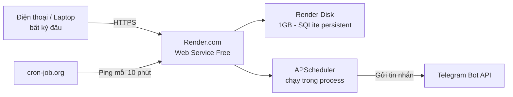

# KẾ HOẠCH DEPLOY — NHANH / GỌN / NHẸ / FREE
## Hệ thống Quản lý Học tập & Deadline Cá nhân (Single-user)

> Mục tiêu: dùng được **mọi lúc mọi nơi**, **không cần chạy máy ở nhà**, **0 đồng chi phí**, setup trong khoảng **30-45 phút**.

---

## 1. Kiến trúc deploy tổng thể



| Thành phần | Dịch vụ | Vai trò | Chi phí |
|---|---|---|---|
| Hosting + Scheduler | **Render.com** (Web Service Free) | Chạy Flask + APScheduler | Free |
| Lưu dữ liệu | **Render Disk** (1GB) | SQLite persistent, không mất khi restart | Free |
| Giữ app luôn "thức" | **cron-job.org** | Ping định kỳ, tránh sleep | Free |
| Gửi thông báo | **Telegram Bot API** | Nhắc deadline, báo cáo tuần | Free, không giới hạn |
| Source control | **GitHub** (repo private) | Lưu code, kích hoạt deploy | Free |

**Tổng chi phí: 0 đồng/tháng.**

---

## 2. Checklist chuẩn bị code trước khi deploy

```
☐ requirements.txt có đủ: flask, flask-sqlalchemy, apscheduler, requests, gunicorn
☐ Procfile: web: gunicorn app:app
☐ Flask serve React build tĩnh (gộp 1 process, không tách 2 server)
☐ SQLite trỏ vào path persistent: sqlite:////data/database.db
☐ Route /ping trả về "ok" (dùng cho cron-job.org)
☐ BOT_TOKEN, CHAT_ID để trong biến môi trường, KHÔNG hardcode
☐ Timezone scheduler set cứng "Asia/Ho_Chi_Minh"
```

---

## 3. Các bước thực hiện (theo thứ tự)

### Bước 1 — Đẩy code lên GitHub
```bash
git init
git add .
git commit -m "Initial commit"
git remote add origin <repo-url>
git push -u origin main
```
→ Repo có thể để **private**, không ảnh hưởng khả năng deploy.

---

### Bước 2 — Tạo bot Telegram (5 phút)
1. Mở Telegram, tìm **@BotFather** → gõ `/newbot` → đặt tên → nhận `BOT_TOKEN`
2. Nhắn bất kỳ tin nào cho bot vừa tạo
3. Truy cập: `https://api.telegram.org/bot<BOT_TOKEN>/getUpdates` → lấy `chat.id` → đó là `CHAT_ID`

---

### Bước 3 — Tạo Web Service trên Render
1. Đăng nhập [render.com](https://render.com) bằng GitHub
2. **New → Web Service** → chọn repo vừa push
3. Cấu hình:
   | Trường | Giá trị |
   |---|---|
   | Runtime | Python 3 |
   | Build Command | `pip install -r requirements.txt` |
   | Start Command | `gunicorn app:app` |
   | Instance Type | **Free** |
4. Thêm **Environment Variables**:
   ```
   BOT_TOKEN = <token của bạn>
   CHAT_ID   = <chat id của bạn>
   ```
5. Bấm **Create Web Service** → Render tự build và deploy, cấp domain dạng:
   ```
   https://ten-app.onrender.com
   ```

---

### Bước 4 — Gắn Persistent Disk (chống mất dữ liệu SQLite)
1. Vào service vừa tạo → tab **Disks** → **Add Disk**
2. Mount path: `/data`, dung lượng: 1GB (free)
3. Trong code, đảm bảo:
   ```python
   app.config['SQLALCHEMY_DATABASE_URI'] = 'sqlite:////data/database.db'
   ```
4. Redeploy lại 1 lần để áp dụng.

---

### Bước 5 — Chống sleep bằng cron-job.org
1. Đăng ký free tại [cron-job.org](https://cron-job.org)
2. Tạo job mới:
   | Trường | Giá trị |
   |---|---|
   | URL | `https://ten-app.onrender.com/ping` |
   | Tần suất | Mỗi 10 phút |
3. Lưu lại → app không bị Render "ngủ" sau 15 phút idle, đảm bảo scheduler nhắc deadline chạy đúng giờ.

---

### Bước 6 — Kiểm tra end-to-end
```
☐ Mở https://ten-app.onrender.com trên điện thoại → app load được
☐ Thêm thử 1 deadline có hạn nộp = ngày mai
☐ Kiểm tra Telegram có nhận được tin nhắn nhắc nhở vào giờ chạy scheduler
☐ Restart service thủ công trên Render (Manual Deploy) → kiểm tra dữ liệu SQLite còn nguyên
```

---

## 4. Bảng theo dõi giới hạn Free Tier (để không bị bất ngờ)

| Dịch vụ | Giới hạn free | Ảnh hưởng thực tế |
|---|---|---|
| Render Web Service | 750 giờ/tháng, ngủ sau 15p idle | Đủ dùng 24/7 cho 1 service; cron-job giữ thức |
| Render Disk | 1GB | SQLite cho app cá nhân dùng nhiều năm chưa đầy |
| cron-job.org | Không giới hạn job cơ bản | Không ảnh hưởng |
| Telegram Bot API | Không giới hạn tin nhắn cá nhân | Không ảnh hưởng |

---

## 5. Lộ trình nâng cấp sau này (nếu cần, không bắt buộc)

| Khi nào cần | Nâng cấp |
|---|---|
| Dữ liệu >1GB hoặc cần backup mạnh hơn | Chuyển SQLite → Render Postgres Free |
| Cần domain riêng (VD `hoctap.tenban.com`) | Mua domain (~200k/năm) + trỏ DNS vào Render |
| Muốn tốc độ ổn định hơn, không phụ thuộc ping | Nâng Render lên gói trả phí thấp nhất (~7$/tháng) |

*Với quy mô 1 người dùng, các nâng cấp này không cần thiết trong thời gian dài.*
