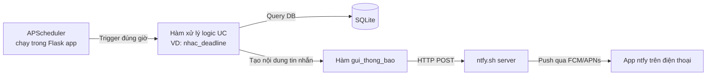
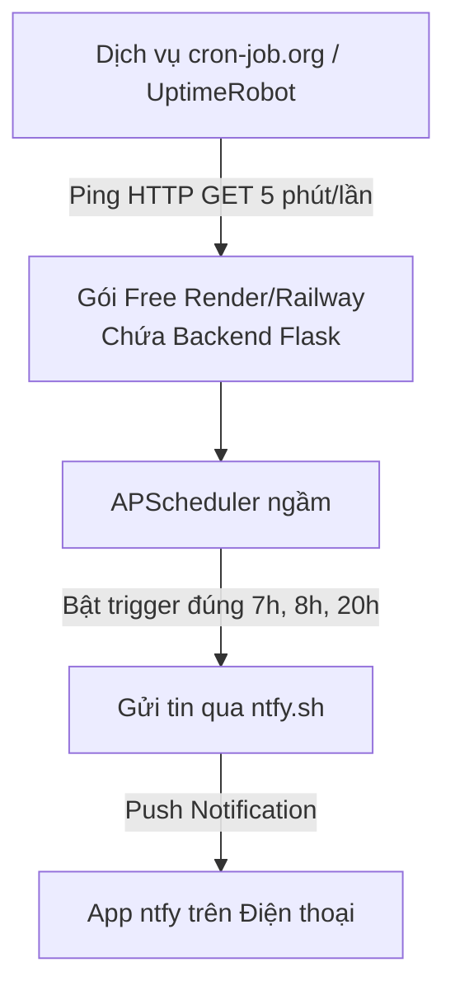

# KẾ HOẠCH THỰC HIỆN — UC THÔNG BÁO VỀ ĐIỆN THOẠI
## Hệ thống Quản lý Học tập & Deadline Cá nhân

> Kênh gửi: **ntfy.sh** — không cần tài khoản, không cần SIM, push thật qua FCM/APNs.

---

## 1. Phạm vi Use Case liên quan

| UC | Tên | Tần suất | Nội dung gửi |
|---|---|---|---|
| UC13 | Nhắc deadline trước hạn (phân tầng ưu tiên) | Hàng ngày, 7h00 | Tên bài tập, môn, số ngày còn lại |
| UC14 | Nhắc nhập liệu định kỳ | Hàng ngày, 20h00 | Tên nhiệm vụ chưa log tiến độ |
| UC15 | Cảnh báo quá tải deadline | Hàng ngày, 7h05 | Danh sách deadline trùng ngày |
| UC16 | Báo cáo tuần tự động | Chủ nhật, 21h00 | Tổng kết số liệu tuần |
| UC10 | Nhắc ôn tập lặp lại (spaced repetition) | Hàng ngày, 8h00 | Tên tài liệu cần ôn lại |

---

## 2. Kiến trúc luồng gửi thông báo



---

## 3. Chuẩn bị (một lần duy nhất)

```
☐ Cài app "ntfy" trên điện thoại (Android: Play Store / iOS: App Store)
☐ Mở app → bấm "+" → Subscribe to topic
☐ Đặt tên topic DÀI, KHÓ ĐOÁN, ví dụ: dung-hoctap-nhacnho-9f3k2xq8
☐ Lưu tên topic này vào biến môi trường NTFY_TOPIC trên Render
☐ Test thử: curl -d "Xin chào" https://ntfy.sh/<topic-cua-ban>
   → kiểm tra điện thoại có nhận được không
```

**Lý do đặt tên topic dài/ngẫu nhiên:** topic trên ntfy.sh mặc định là public — ai biết tên đều gửi/đọc được. Tên đủ dài + ngẫu nhiên (10+ ký tự, có số) giúp an toàn cho use case cá nhân không nhạy cảm.

---

## 4. Hàm gửi thông báo dùng chung (base function)

```python
import requests
import os

NTFY_TOPIC = os.environ.get("NTFY_TOPIC")
NTFY_URL = f"https://ntfy.sh/{NTFY_TOPIC}"

def gui_thong_bao(noi_dung: str, tieu_de: str = "Nhắc nhở học tập", 
                   uu_tien: str = "default", tags: str = ""):
    """
    uu_tien: 'default' | 'high' | 'urgent' | 'low'
    tags: emoji ngắn cho ntfy tự render (VD: 'warning', 'calendar')
    """
    try:
        requests.post(
            NTFY_URL,
            data=noi_dung.encode("utf-8"),
            headers={
                "Title": tieu_de.encode("utf-8"),
                "Priority": uu_tien,
                "Tags": tags
            },
            timeout=10
        )
        return True
    except requests.RequestException as e:
        # Ghi log lỗi vào bảng LOG_LOI để kiểm tra sau, không làm sập scheduler
        ghi_log_loi_gui(str(e))
        return False
```

---

## 5. Triển khai chi tiết từng UC

### UC13 — Nhắc deadline (phân tầng theo ưu tiên)

```python
from datetime import date

def nhac_deadline():
    homnay = date.today()
    deadlines = Deadline.query.filter(Deadline.trang_thai != "Hoan_thanh").all()

    for dl in deadlines:
        so_ngay_con_lai = (dl.han_nop - homnay).days
        nguong = [2, 1] if dl.do_uu_tien == "Cao" else [1]

        if so_ngay_con_lai in nguong:
            mon = MonHoc.query.get(dl.ma_mon)
            noi_dung = f"'{dl.ten_bai_tap}' ({mon.ten_mon}) còn {so_ngay_con_lai} ngày, hạn {dl.han_nop.strftime('%d/%m/%Y')}"
            muc_uu_tien = "urgent" if so_ngay_con_lai == 1 else "high"
            gui_thong_bao(noi_dung, tieu_de="Deadline sắp đến", 
                          uu_tien=muc_uu_tien, tags="warning")
```

**Lịch chạy:** `scheduler.add_job(nhac_deadline, 'cron', hour=7, minute=0)`

---

### UC14 — Nhắc nhập liệu định kỳ

```python
from datetime import timedelta

def nhac_nhap_lieu():
    dang_lam = Deadline.query.filter_by(trang_thai="Dang_lam").all()

    for dl in dang_lam:
        mon = MonHoc.query.get(dl.ma_mon)
        nguong_ngay = 2 if mon.loai_mon == "Tu_hoc" else 3

        log_gan_nhat = (NhatKyThoiGian.query
                        .filter_by(ma_bai_tap=dl.ma_bai_tap)
                        .order_by(NhatKyThoiGian.ngay.desc())
                        .first())

        so_ngay_khong_log = (date.today() - log_gan_nhat.ngay).days if log_gan_nhat else 999

        if so_ngay_khong_log >= nguong_ngay:
            noi_dung = f"Bạn chưa cập nhật tiến độ '{dl.ten_bai_tap}' ({mon.ten_mon}) trong {so_ngay_khong_log} ngày"
            gui_thong_bao(noi_dung, tieu_de="Nhắc cập nhật tiến độ", tags="memo")
```

**Lịch chạy:** `scheduler.add_job(nhac_nhap_lieu, 'cron', hour=20, minute=0)`

---

### UC15 — Cảnh báo quá tải deadline

```python
from collections import defaultdict

def canh_bao_qua_tai():
    deadlines = Deadline.query.filter(Deadline.trang_thai != "Hoan_thanh").all()
    theo_ngay = defaultdict(list)

    for dl in deadlines:
        theo_ngay[dl.han_nop].append(dl)

    for ngay, ds in theo_ngay.items():
        if len(ds) >= 3:
            ten_bai = ", ".join([d.ten_bai_tap for d in ds])
            noi_dung = f"Ngày {ngay.strftime('%d/%m/%Y')} có {len(ds)} deadline trùng: {ten_bai}"
            gui_thong_bao(noi_dung, tieu_de="Cảnh báo quá tải", 
                          uu_tien="high", tags="rotating_light")
```

**Lịch chạy:** `scheduler.add_job(canh_bao_qua_tai, 'cron', hour=7, minute=5)`

---

### UC16 — Báo cáo tuần tự động

```python
def bao_cao_tuan():
    mot_tuan_truoc = date.today() - timedelta(days=7)

    hoan_thanh = Deadline.query.filter(
        Deadline.trang_thai == "Hoan_thanh"
    ).count()

    tong_gio = (db.session.query(db.func.sum(NhatKyThoiGian.gio_thuc_te))
                .filter(NhatKyThoiGian.ngay >= mot_tuan_truoc)
                .scalar()) or 0

    mon_tre_nhieu = (db.session.query(MonHoc.ten_mon, db.func.count(Deadline.ma_bai_tap))
                      .join(Deadline)
                      .filter(Deadline.trang_thai == "Tre_han")
                      .group_by(MonHoc.ten_mon)
                      .order_by(db.func.count(Deadline.ma_bai_tap).desc())
                      .first())

    noi_dung = (f"Tuần này: {hoan_thanh} deadline hoàn thành, "
                f"{tong_gio:.1f} giờ học. "
                f"Môn trễ nhiều nhất: {mon_tre_nhieu[0] if mon_tre_nhieu else 'Không có'}")
    gui_thong_bao(noi_dung, tieu_de="Báo cáo tuần", tags="bar_chart")
```

**Lịch chạy:** `scheduler.add_job(bao_cao_tuan, 'cron', day_of_week='sun', hour=21)`

---

### UC10 — Nhắc ôn tập lặp lại (spaced repetition)

```python
def nhac_on_tap():
    tai_lieu = TaiLieu.query.all()
    moc_ngay = [1, 3, 7]

    for tl in tai_lieu:
        so_ngay_da_qua = (date.today() - tl.ngay_them).days
        if so_ngay_da_qua in moc_ngay:
            noi_dung = f"Đã {so_ngay_da_qua} ngày kể từ khi thêm '{tl.ten_tai_lieu}' — nên ôn lại"
            gui_thong_bao(noi_dung, tieu_de="Nhắc ôn tập", tags="books")
```

**Lịch chạy:** `scheduler.add_job(nhac_on_tap, 'cron', hour=8, minute=0)`

---

## 6. Đăng ký toàn bộ jobs vào Scheduler (file khởi động app)

```python
from apscheduler.schedulers.background import BackgroundScheduler
import atexit

scheduler = BackgroundScheduler(timezone="Asia/Ho_Chi_Minh")

scheduler.add_job(nhac_deadline,     'cron', hour=7,  minute=0)
scheduler.add_job(nhac_on_tap,       'cron', hour=8,  minute=0)
scheduler.add_job(nhac_nhap_lieu,    'cron', hour=20, minute=0)
scheduler.add_job(canh_bao_qua_tai,  'cron', hour=7,  minute=5)
scheduler.add_job(bao_cao_tuan,      'cron', day_of_week='sun', hour=21)

scheduler.start()
atexit.register(lambda: scheduler.shutdown())
```

---

## 7. Xử lý lỗi & độ tin cậy

### Bảng `LOG_LOI` (mới, phục vụ debug)

| Trường | Kiểu | Ghi chú |
|---|---|---|
| `ma_log_loi` | VARCHAR(30) PK | |
| `thoi_gian` | DATETIME | Auto = now |
| `noi_dung_loi` | TEXT | Exception message |
| `ham_gay_loi` | VARCHAR(100) | Tên hàm gọi lúc lỗi |

```python
def ghi_log_loi_gui(loi: str, ham: str = ""):
    log = LogLoi(noi_dung_loi=loi, ham_gay_loi=ham, thoi_gian=datetime.now())
    db.session.add(log)
    db.session.commit()
```

### Nguyên tắc chống mất thông báo

1. Mọi `gui_thong_bao()` đều bọc `try/except` — 1 lần gửi lỗi không làm sập cả job (job vẫn tiếp tục xử lý các deadline còn lại).
2. Route `/ping` (đã có sẵn cho cron-job.org) kiêm luôn việc giữ app thức, đảm bảo scheduler chạy đúng giờ đã đặt.
3. Có thể thêm route kiểm tra thủ công `/debug/lich-su-loi` để xem nhanh các lần gửi thất bại gần nhất.

---

## 8. Checklist triển khai

```
☐ Cài app ntfy, subscribe topic riêng, lưu NTFY_TOPIC vào Render Env Variables
☐ Viết hàm gui_thong_bao() dùng chung
☐ Viết 5 hàm xử lý UC10, UC13, UC14, UC15, UC16
☐ Đăng ký lịch chạy cho từng hàm trong BackgroundScheduler
☐ Thêm bảng LOG_LOI + hàm ghi log lỗi
☐ Test thủ công: gọi từng hàm qua route /debug/test-nhac-deadline trước khi để chạy tự động
☐ Xác nhận điện thoại nhận được thông báo đúng nội dung, đúng giờ trong 2-3 ngày đầu
```

---

## 9. HƯỚNG DẪN TỰ ĐỘNG HÓA GỬI TIN NHẮN (AUTOMATION GUIDE)

Có **2 mô hình chính** để hệ thống tự động chạy ngầm gửi push notification đúng giờ hàng ngày:

### Mô hình A: Tự động hóa trên máy cá nhân (Local Machine Automation - macOS)
Khi ứng dụng Flask chạy trên máy cá nhân, bộ lập lịch `APScheduler` bên trong `app.py` sẽ **tự động kiểm tra và đẩy tin nhắn** theo khung giờ:
- **07:00** — UC13 Nhắc Deadline
- **07:05** — UC15 Cảnh báo Quá tải Deadline
- **08:00** — UC10 Nhắc Ôn tập Spaced Repetition
- **20:00** — UC14 Nhắc Nhập liệu Giờ học
- **21:00 (Chủ nhật)** — UC16 Báo cáo Tuần

#### Cách làm Flask chạy ngầm tự khởi động cùng máy Mac (macOS LaunchDaemon):
Tạo file `~/Library/LaunchAgents/com.agystudy.app.plist`:
```xml
<?xml version="1.0" encoding="UTF-8"?>
<!DOCTYPE plist PUBLIC "-//Apple//DTD PLIST 1.0//EN" "http://www.apple.com/DTDs/PropertyList-1.0.dtd">
<plist version="1.0">
<dict>
    <key>Label</key>
    <string>com.agystudy.app</string>
    <key>ProgramArguments</key>
    <array>
        <string>/Users/batman/Desktop/IELTS/venv/bin/python</string>
        <string>/Users/batman/Desktop/IELTS/app.py</string>
    </array>
    <key>RunAtLoad</key>
    <true/>
    <key>KeepAlive</key>
    <true/>
    <key>WorkingDirectory</key>
    <string>/Users/batman/Desktop/IELTS</string>
</dict>
</plist>
```
Lệnh bật chạy tự động:
```bash
launchctl load ~/Library/LaunchAgents/com.agystudy.app.plist
```

---

### Mô hình B: Tự động hóa trên Cloud (Deploy lên Render / Railway / PythonAnywhere)
Đây là cách **tốt nhất và phổ biến nhất** giúp hệ thống gửi tin nhắn 24/7 cả khi tắt máy tính cá nhân.



1. **Upload code lên GitHub & Deploy Render.com**:
   - Web Service Command: `./venv/bin/gunicorn app:app` (hoặc `python app.py`).
   - Thêm Environment Variable: `NTFY_TOPIC = dung-hoctap-nhacnho-9f3k2xq8`.

2. **Chống Sleep bằng cron-job.org (Miễn phí)**:
   - Các host miễn phí (Render) tự ngủ sau 15 phút không có request.
   - Đăng ký tài khoản trên [cron-job.org](https://cron-job.org).
   - Tạo 1 Cronjob mới: URL `https://ten-app-cua-ban.onrender.com/api/dashboard` (Schedule: **Every 5 minutes**).
   - **Tác dụng:** Giữ ứng dụng luôn thức để `APScheduler` bắn tin nhắn đẩy đúng từng phút theo thời gian thực.

