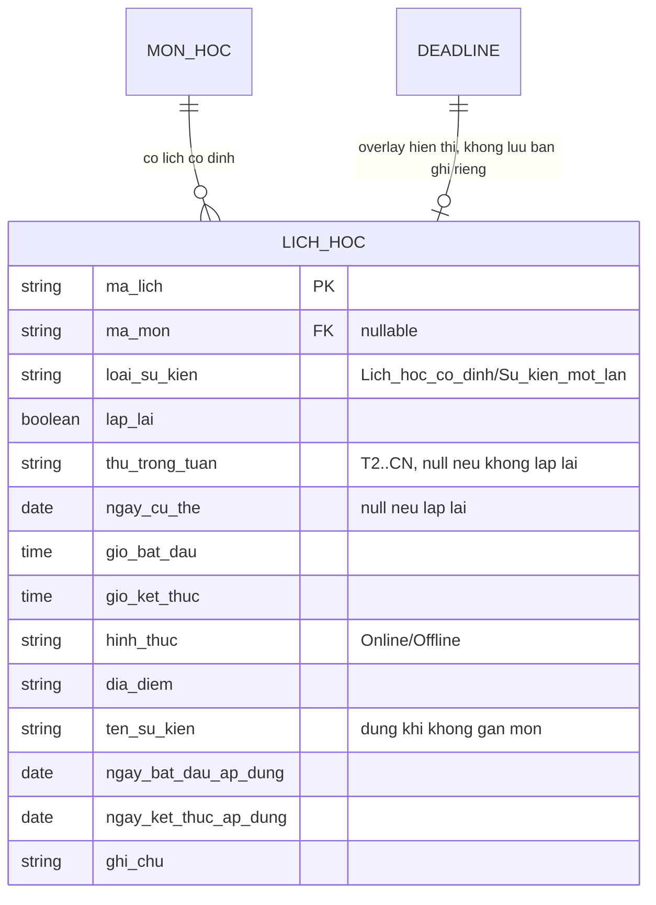
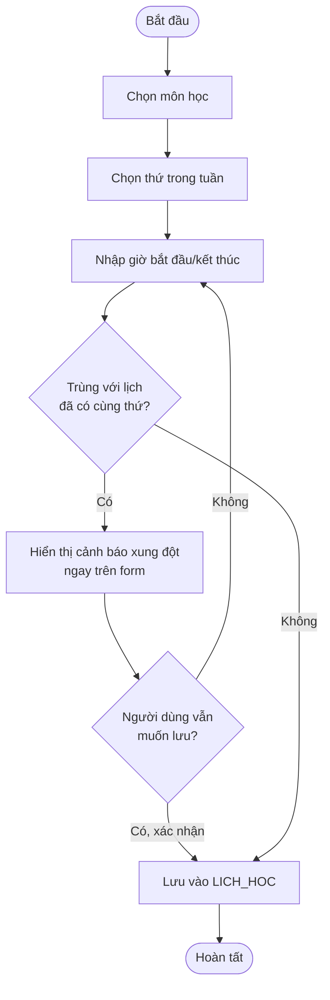
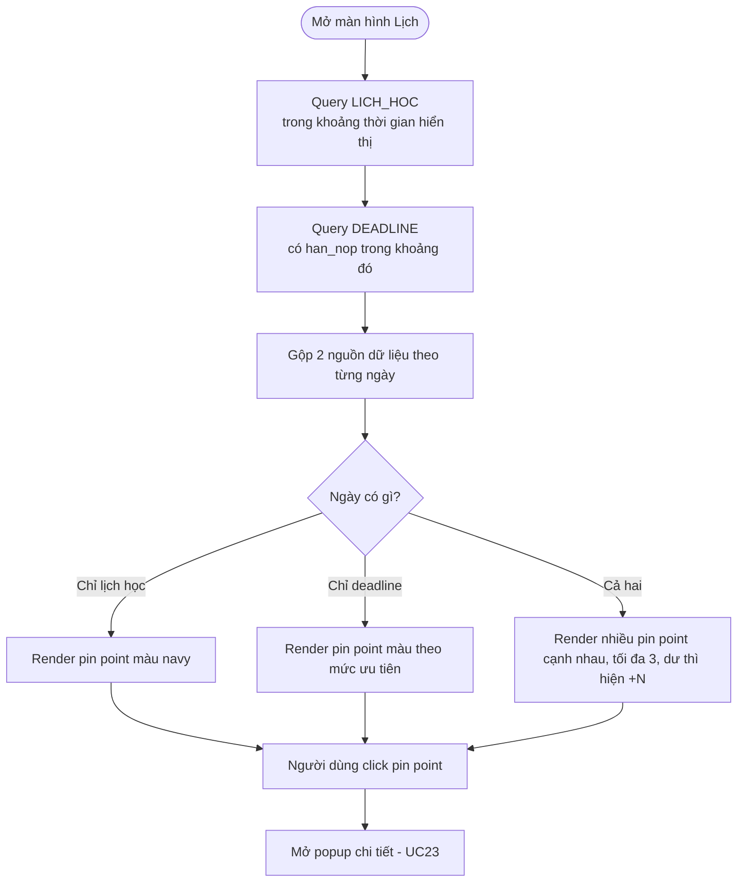

# KẾ HOẠCH THỰC HIỆN — UC THỜI KHÓA BIỂU & LỊCH HỌC (PIN POINT)
## Hệ thống Quản lý Học tập & Deadline Cá nhân

> Mục tiêu: có 1 màn hình lịch (dạng tuần/tháng) hiển thị **cả lịch học cố định lẫn deadline** dưới dạng **pin point (chấm đánh dấu)** trên từng ngày — nhìn 1 cái là biết ngày đó có gì, không cần mở từng bảng riêng.

---

## 1. Vấn đề cần giải quyết

Hiện tại, thời khóa biểu (`LICH_HOC`) và deadline (`DEADLINE`) đang nằm ở 2 nơi tách biệt — muốn biết "hôm nay/tuần này có gì" phải xem 2 bảng riêng. Cần:

1. Một **màn hình lịch trực quan** (tuần/tháng) làm trung tâm kiểm tra nhanh
2. **Pin point** trên mỗi ngày: chấm nhỏ báo hiệu có lịch học cố định, có deadline, hoặc cả hai — không cần mở ra mới biết
3. Phân biệt được **lịch học lặp lại hàng tuần** (cố định theo thời khóa biểu) và **sự kiện một lần** (deadline, buổi học bù, lịch thi...)

---

## 2. Actor

| Actor | Vai trò |
|---|---|
| Người dùng | Nhập thời khóa biểu, xem lịch, click vào pin point để xem chi tiết |
| Scheduler | Tự động đồng bộ deadline lên lịch mỗi khi có deadline mới được tạo/cập nhật |

---

## 3. Danh sách Use Case

### UC19 — Tạo thời khóa biểu cố định (lặp lại hàng tuần)

- Input: môn học (dropdown), thứ trong tuần, khung giờ bắt đầu/kết thúc, địa điểm (nếu offline), hình thức (online/offline)
- Output: bản ghi trong `LICH_HOC`, đánh dấu `lap_lai = true` (áp dụng mọi tuần cho đến khi môn kết thúc)
- Ràng buộc: hệ thống kiểm tra **trùng giờ** với lịch học đã có → cảnh báo ngay khi nhập, không cho lưu nếu trùng hoàn toàn (có thể cho phép trùng nếu người dùng xác nhận, VD học online 2 chỗ cùng lúc để dự thính)

### UC20 — Thêm sự kiện một lần (không lặp lại)

- Input: tên sự kiện (VD: "Học bù", "Thi giữa kỳ", "Bảo vệ đồ án"), ngày cụ thể, khung giờ, môn liên quan (tùy chọn), địa điểm
- Output: bản ghi `LICH_HOC` với `lap_lai = false`, chỉ áp dụng đúng 1 ngày đó

### UC21 — Xem lịch dạng Tuần (Weekly View) với Pin Point

- Input: không có (mặc định tuần hiện tại), có thể chuyển tuần trước/sau
- Output: hiển thị lưới 7 ngày × khung giờ, mỗi ô có lịch học hiện dạng khối màu; **mỗi ngày có 1 dải pin point nhỏ phía trên** báo số lượng deadline đến hạn ngày đó

### UC22 — Xem lịch dạng Tháng (Monthly View) với Pin Point

- Input: chọn tháng
- Output: lưới tháng dạng ô ngày; mỗi ô ngày có tối đa 3 pin point nhỏ (chấm màu) đại diện: lịch học cố định (chấm xanh navy), deadline sắp đến (chấm vàng/đỏ theo mức khẩn), sự kiện một lần (chấm tím). Click vào ngày → mở popup danh sách chi tiết

### UC23 — Click Pin Point → Xem chi tiết nhanh

- Input: click vào 1 pin point hoặc 1 ô ngày trên lịch
- Output: popup nhỏ hiển thị: tên sự kiện/deadline, giờ, môn học, trạng thái — có nút "Đi tới chi tiết" để mở form cập nhật đầy đủ (UC06)

### UC24 — Tự động đồng bộ Deadline lên Lịch (background sync)

- Actor: Scheduler / trigger khi UC04, UC05 (tạo deadline) được thực hiện
- Mô tả: mỗi khi có deadline mới hoặc `han_nop` bị đổi, hệ thống tự cập nhật lại pin point tương ứng trên lịch — không cần người dùng nhập tay 2 lần
- Không tạo bản ghi mới trong `LICH_HOC`; deadline được **query trực tiếp và overlay** lên view lịch tại thời điểm hiển thị (tránh trùng lặp dữ liệu)

### UC25 — Phát hiện xung đột lịch (Conflict Detection)

- Input: khi thêm lịch học mới hoặc sự kiện một lần (UC19, UC20)
- Điều kiện: khung giờ mới trùng với 1 khung giờ đã tồn tại trong `LICH_HOC` ở cùng thứ/ngày
- Output: cảnh báo ngay tại form (không phải thông báo đẩy điện thoại) — "Khung giờ này trùng với [tên môn/sự kiện] đã có"

### UC26 — Chỉnh sửa / Xóa lịch học

- Input: chọn 1 mục trong lịch (từ view tuần/tháng hoặc danh sách)
- Output: cho sửa giờ, địa điểm, hoặc xóa; nếu là lịch lặp lại, hỏi rõ "Xóa chỉ tuần này" hay "Xóa toàn bộ chuỗi lặp lại"

---

## 4. Mở rộng cấu trúc dữ liệu

### 4.1. Cập nhật bảng `LICH_HOC` (đã có trong thiết kế gốc, bổ sung thêm trường)

| Trường | Kiểu dữ liệu | Ràng buộc | Ghi chú |
|---|---|---|---|
| `ma_lich` | VARCHAR(30) | PK | |
| `ma_mon` | VARCHAR(20) | FK → MON_HOC, **nullable** | Nullable vì sự kiện một lần có thể không gắn môn (VD "Họp nhóm") |
| `loai_su_kien` | ENUM | NOT NULL | `Lich_hoc_co_dinh` \| `Su_kien_mot_lan` |
| `lap_lai` | BOOLEAN | Default false | true = áp dụng mọi tuần |
| `thu_trong_tuan` | ENUM | Bắt buộc nếu `lap_lai = true` | `T2`...`T7`, `CN` |
| `ngay_cu_the` | DATE | Bắt buộc nếu `lap_lai = false` | Dùng cho sự kiện một lần |
| `gio_bat_dau` | TIME | NOT NULL | |
| `gio_ket_thuc` | TIME | NOT NULL | |
| `hinh_thuc` | ENUM | | `Online` \| `Offline` |
| `dia_diem` | VARCHAR(200) | | Bắt buộc nếu `hinh_thuc = Offline` |
| `ten_su_kien` | VARCHAR(200) | | Dùng khi không gắn `ma_mon` |
| `ngay_bat_dau_ap_dung` | DATE | | Với lịch lặp lại: từ ngày nào |
| `ngay_ket_thuc_ap_dung` | DATE | | Với lịch lặp lại: đến ngày nào (VD hết kỳ học) |
| `ghi_chu` | TEXT | | |

### 4.2. ERD cập nhật (phần liên quan lịch)



> **Lưu ý quan trọng:** Deadline **không được sao chép** thành bản ghi mới trong `LICH_HOC`. View lịch sẽ **query cả 2 bảng cùng lúc** (`LICH_HOC` + `DEADLINE` theo `han_nop`) rồi overlay pin point lên cùng 1 giao diện — tránh trùng lặp và đảm bảo khi deadline đổi hạn, lịch tự động cập nhật theo mà không cần đồng bộ thủ công (giải quyết đúng UC24).

---

## 5. Luồng hoạt động

### 5.1. Luồng tạo lịch học cố định + kiểm tra xung đột



### 5.2. Luồng render Pin Point trên lịch (khi mở view Tuần/Tháng)



---

## 6. Thiết kế UI/UX bổ sung (nhất quán với Design System đã có)

### 6.1. Quy ước màu Pin Point (tuân theo bảng màu đã định nghĩa)

| Loại | Màu chấm | Mã HEX |
|---|---|---|
| Lịch học cố định | Navy | `#1E3A5F` |
| Deadline ưu tiên Cao | Đỏ đất | `#8A2C2C` |
| Deadline ưu tiên TB/Thấp | Vàng đất | `#B58500` |
| Sự kiện một lần (không gắn môn) | Tím trầm | `#5B4B8A` |

### 6.2. Wireframe — View Tháng (Monthly View)

```
┌──────────────────────────────────────────────────────────────┐
│  LỊCH HỌC                    [ < Tháng 7/2026 > ]  [Tuần|Tháng]│
├──────────────────────────────────────────────────────────────┤
│  T2      T3      T4      T5      T6      T7      CN          │
├────────┼────────┼────────┼────────┼────────┼────────┼────────┤
│  13     │  14    │  15    │  16    │  17    │  18    │  19    │
│  ● ●    │  ●     │  ● ● ●+│  ●     │  ●●    │        │        │  ← Dải pin point nhỏ trên mỗi ô
│         │        │        │        │        │        │        │
└────────┴────────┴────────┴────────┴────────┴────────┴────────┘

Click vào ngày 15 →
┌──────────────────────────────┐
│  Thứ Tư, 15/07/2026    [ × ] │
├──────────────────────────────┤
│  ● Giải tích 2   7h-9h        │  ← navy = lịch học cố định
│  ● Bài tập chương 5   Hạn hôm │  ← đỏ = deadline ưu tiên Cao
│    nay                        │
│  ● Lab 12 ITSS   Hạn hôm nay  │  ← vàng = ưu tiên TB
│                                │
│              [ Xem chi tiết → ]│
└──────────────────────────────┘
```

### 6.3. Wireframe — View Tuần (Weekly View, có khung giờ)

```
┌──────────────────────────────────────────────────────────────┐
│  LỊCH HỌC                 [ < Tuần 13-19/07 > ]  [Tuần|Tháng] │
├──────────────────────────────────────────────────────────────┤
│        T2      T3      T4      T5      T6      T7      CN    │
│  Pin:  ● ●     ●       ● ● ●+  ●       ●●                     │  ← Dải pin point đầu mỗi cột
├────────────────────────────────────────────────────────────── │
│ 7h  ┌──────┐                 ┌──────┐                          │
│     │Giải  │                 │Giải  │                          │
│     │tích 2│                 │tích 2│                          │  ← Khối lịch học, nền navy nhạt
│ 9h  └──────┘                 └──────┘                          │
│                                                                │
│11h          ┌──────┐                                          │
│             │ITSS  │                                          │
│13h          └──────┘                                          │
└──────────────────────────────────────────────────────────────┘
```

### 6.4. Form "Thêm lịch học cố định"

```
┌──────────────────────────────────────────────────────────────┐
│  THÊM LỊCH HỌC CỐ ĐỊNH                               [ × ]    │
├──────────────────────────────────────────────────────────────┤
│  Môn học                                                      │
│  [ Chọn môn học ▾ ]                                           │
│                                                                │
│  Thứ trong tuần                                               │
│  [ Thứ 2 ▾ ]                                                  │
│                                                                │
│  Giờ bắt đầu               Giờ kết thúc                       │
│  ( __:__ )                 ( __:__ )                          │
│                                                                │
│  Hình thức                 Địa điểm                          │
│  [ Offline ▾ ]              ┌────────────────────┐            │
│                              │                    │            │
│                              └────────────────────┘            │
│                                                                │
│  Áp dụng từ                 Đến                               │
│  ( __/__/____ )              ( __/__/____ )                   │
│                                                                │
│  ⚠ Trùng với "ITSS" (11h-13h Thứ 2) đã có trong lịch          │
│    (chỉ hiện khi phát hiện xung đột — nền vàng nhạt #FFF4E0)  │
│                                                                │
│                          [ Hủy ]   [ Vẫn lưu ]   [ Sửa lại ]  │
└──────────────────────────────────────────────────────────────┘
```

---

## 7. Bảng ưu tiên triển khai

| Phase | Use Case | Ghi chú |
|---|---|---|
| MVP | UC19, UC21, UC24 | Lịch học cố định + view tuần + overlay deadline cơ bản |
| Phase 2 | UC22, UC23 | View tháng + popup chi tiết |
| Phase 3 | UC20, UC25, UC26 | Sự kiện một lần, phát hiện xung đột, sửa/xóa |

---

## 8. Checklist triển khai

```
☐ Mở rộng bảng LICH_HOC theo cấu trúc mục 4.1
☐ Viết query gộp LICH_HOC + DEADLINE theo khoảng ngày (dùng chung cho view Tuần/Tháng)
☐ Component React: CalendarWeekView.jsx, CalendarMonthView.jsx
☐ Component PinPointBadge.jsx (chấm màu, tái sử dụng theo bảng màu mục 6.1)
☐ Logic kiểm tra xung đột giờ khi tạo/sửa LICH_HOC (UC25)
☐ Popup chi tiết khi click ngày/pin point (UC23)
☐ Test: tạo lịch học cố định 1 tuần, tạo vài deadline trùng ngày, xác nhận pin point hiển thị đúng
```
