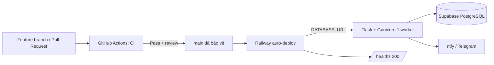
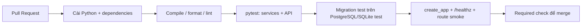

# Kế hoạch CI/CD & triển khai Supabase PostgreSQL

> Phạm vi: đưa AGY Study Manager từ SQLite cục bộ lên Supabase PostgreSQL và thiết lập quy trình kiểm thử, triển khai, giám sát, rollback an toàn.  
> Môi trường đích: GitHub + GitHub Actions + Supabase + Railway.

## 1. Mục tiêu và nguyên tắc

| Mục tiêu | Tiêu chí hoàn thành |
|---|---|
| Không mất dữ liệu SQLite hiện có | Có bản sao lưu, import có đối soát số bản ghi và chỉ chuyển DNS/app sang DB mới sau khi nghiệm thu |
| Không deploy code lỗi | Mọi Pull Request phải qua lint/syntax, test nghiệp vụ và smoke test trước khi merge |
| Không lộ secret | Không commit URI, database password, token Telegram hoặc NTFY vào repository/log CI |
| Deploy có kiểm soát | Chỉ nhánh `main` được lên production; health check pass mới nhận traffic |
| Có đường lui | Có backup, mốc release và procedure quay lại phiên bản/DB trước trong thời gian xác định |

## 2. Kiến trúc mục tiêu

Quyết định cho giai đoạn đầu:

- Railway thực hiện Continuous Delivery qua GitHub autodeploy; GitHub Actions chỉ chịu trách nhiệm kiểm tra chất lượng. Không cần lưu `RAILWAY_TOKEN` trong GitHub nếu Railway đã liên kết repository.
- Duy trì `gunicorn --workers 1` vì APScheduler hiện chạy trong process Flask. Tăng worker/replica khi chưa tách scheduler sẽ làm gửi thông báo trùng.
- Production dùng Supabase PostgreSQL. SQLite chỉ còn dành cho local development và CI unit test.

## 3. Những việc cần sửa trước khi chuyển production

| Hạng mục | Hiện trạng | Việc cần làm | Điều kiện pass |
|---|---|---|---|
| Health check | `/ping` có thể chạy job nhắc deadline, gây side effect | Thêm `GET /healthz` chỉ kiểm tra app/DB và luôn không gửi notification; đổi Railway health check sang `/healthz` | Gọi health check nhiều lần không thay đổi dữ liệu/gửi tin |
| Migration | `db.create_all()` và SQLite migration thủ công | Dùng Alembic/Flask-Migrate, commit migration theo version | `alembic upgrade head` chạy được trên DB trống và DB đã có dữ liệu |
| Test | Workflow mới syntax + smoke, chưa có test nghiệp vụ | Bổ sung pytest cho service/API; test SRS, deadline, calendar và config DB | CI báo fail khi thay đổi làm hỏng use case |
| Scheduler | Gắn với web process | Khóa `workers=1`, ghi rõ trong README; giai đoạn sau tách worker scheduler riêng nếu scale | Mỗi lịch cron chỉ chạy một lần |
| Config | Đã ưu tiên `DATABASE_URL` / `SUPABASE_DB_URL` | Bổ sung `.env.example`, không có secret thật; định nghĩa rõ config dev/staging/prod | App local vẫn fallback SQLite |

## 4. Thiết kế môi trường và secrets

### 4.1 Môi trường

| Môi trường | Nhánh kích hoạt | App Railway | Database Supabase | Mục đích |
|---|---|---|---|---|
| Local | mọi nhánh | máy cá nhân | SQLite | phát triển nhanh |
| Staging | `staging` | Railway Staging | Supabase project Staging riêng | kiểm tra deploy/migration thật |
| Production | `main` | Railway Production | Supabase project Production | người dùng thực |

Không dùng chung project Supabase hoặc database password giữa staging và production.

### 4.2 Secrets/variables bắt buộc

Lưu ở Railway Variables cho runtime. Nếu job migration chạy trong GitHub Actions thì URI chỉ đặt trong GitHub Environment secret `production`, không dùng repository secret chung.

| Biến | Nơi lưu | Mục đích |
|---|---|---|
| `DATABASE_URL` | Railway Staging/Production | URI PostgreSQL đầy đủ của Supabase |
| `NTFY_TOPIC` | Railway | Topic notification theo từng môi trường |
| `TELEGRAM_BOT_TOKEN` | Railway secret | Token bot production, nếu dùng |
| `TELEGRAM_CHAT_ID` | Railway secret | Chat nhận thông báo |
| `FLASK_ENV` hoặc `APP_ENV` | Railway variable | Nhận diện môi trường, không chứa secret |

Không log `DATABASE_URL`; các lệnh debug chỉ được in hostname đã che mật khẩu.

## 5. Kế hoạch database Supabase

### 5.1 Tạo và kết nối project

1. Tạo hai Supabase project: `agy-study-staging` và `agy-study-production`; chọn region gần Railway/người dùng nhất.
2. Lấy URI từ **Connect** trong Supabase Dashboard.
3. Với Railway là long-running service, ưu tiên **Direct connection** nếu Railway có IPv6. Nếu không kết nối được do mạng IPv4-only, dùng **Shared Pooler — Session mode** (port `5432`). Không dùng transaction pooler `6543` cho app scheduler dài hạn trừ khi đã cấu hình lại SQLAlchemy theo chế độ đó.
4. Đặt URI vào Railway Variable `DATABASE_URL`; app đã tự chuẩn hóa prefix cũ `postgres://` thành `postgresql://`.
5. Cấu hình SQLAlchemy pool nhỏ cho production (ví dụ pool 2, overflow 3) sau khi đo giới hạn connection của plan Supabase; không giữ mặc định cao khi chưa cần.

### 5.2 Migration versioned

1. Khởi tạo Alembic và tạo baseline migration phản ánh toàn bộ model hiện có, gồm module từ vựng.
2. Thay đổi schema mới luôn đi qua migration commit cùng code; không sửa production bằng Table Editor thủ công.
3. Deploy theo chiến lược **expand → migrate/backfill → switch code → contract**:
   - Thêm cột/index nullable hoặc bảng mới trước.
   - Backfill theo batch, có thể resume.
   - Deploy code đọc/ghi schema mới.
   - Chỉ xóa cột cũ ở release sau khi xác nhận không còn code phụ thuộc.
4. Lệnh migration chạy một lần trước khi Gunicorn nhận traffic. Không chạy migration đồng thời trên nhiều replica.

### 5.3 Chuyển dữ liệu SQLite lần đầu

1. Bảo trì ngắn: dừng ghi dữ liệu, copy `database.db` với timestamp và kiểm tra file mở được.
2. Chạy migration trên Supabase trống.
3. Chạy script import idempotent SQLite → PostgreSQL theo thứ tự FK: `MON_HOC` → `DEADLINE`/`TAI_LIEU`/`MUC_TIEU`/`LICH_HOC` → lịch sử/log → các bảng Vocabulary.
4. Đối soát cho từng bảng: `COUNT(*)`, khóa chính trùng, số FK orphan, dữ liệu ngày/Unicode tiếng Việt.
5. Chạy smoke test bằng app trỏ vào Supabase staging; thử tạo/sửa/xóa dữ liệu và một lượt SRS.
6. Đổi `DATABASE_URL` production, deploy release đã được duyệt, xác nhận UI và `/healthz`.
7. Giữ SQLite backup ở nơi mã hóa/riêng tư ít nhất 30 ngày; chỉ xóa khi đã có backup Supabase và nghiệm thu.

## 6. Thiết kế GitHub Actions

### 6.1 CI cho Pull Request

Các job đề xuất:

| Job | Nội dung |
|---|---|
| `quality` | `py_compile`, formatter/linter (Ruff), `node --check static/js/app.js` |
| `test` | pytest với `DB_PATH` tạm; không dùng DB production |
| `migration-check` | tạo database rỗng, chạy `alembic upgrade head`, chạy app smoke |
| `security` | quét secret (`gitleaks` hoặc tương đương) và dependency audit ở mức cảnh báo/đã duyệt |

Thiết lập branch protection cho `main`: bắt buộc PR, tối thiểu một review và tất cả required checks pass.

### 6.2 CD cho staging và production

| Trigger | Hành động |
|---|---|
| Push vào `staging` sau khi CI pass | Railway Staging build → migration → health check `/healthz` → smoke test URL staging |
| Merge vào `main` sau khi CI pass | Railway Production deploy cùng pipeline trên |
| Fail migration/health check | Deployment không active; xem Railway log, không retry mù quáng |
| Rollback | Redeploy commit release trước; chỉ rollback schema khi migration đã được thiết kế reversible và chưa có dữ liệu mới phụ thuộc |

GitHub Environment `production` nên giới hạn branch `main` và chứa riêng secrets phục vụ migration/verification. Với repository private, cần kiểm tra gói GitHub có hỗ trợ environment secret/protection rule mong muốn trước khi dùng approval gate.

## 7. Thứ tự triển khai đề xuất

| Mốc | Công việc | Đầu ra |
|---|---|---|
| M1 — Foundation | Thêm `/healthz`, `.env.example`, pytest, lint và branch protection | CI có test thật, không có secret trong repo |
| M2 — Migration | Tích hợp Alembic, baseline migration, test migration | Schema versioned và reproducible |
| M3 — Staging DB | Tạo Supabase staging + Railway staging; cấu hình URI và deploy thử | App staging hoạt động trên PostgreSQL |
| M4 — Data migration rehearsal | Chạy import từ bản copy SQLite, đối soát và test use case | Runbook đã được thực hành |
| M5 — Production cutover | Backup cuối, import, đổi `DATABASE_URL`, deploy production | Production dùng Supabase |
| M6 — Vận hành | Backup định kỳ, alert deploy lỗi, review pool/scheduler | Vận hành ổn định và có rollback |

## 8. Checklist nghiệm thu

- [ ] Không có `DATABASE_URL`, password hay token thật trong git history/workflow logs.
- [ ] `main` chỉ merge khi CI pass.
- [ ] `/healthz` trả 200 và không tạo notification/log nghiệp vụ.
- [ ] Railway chỉ bật một instance scheduler; `gunicorn --workers 1` được giữ nguyên cho tới khi tách worker.
- [ ] Tất cả migration chạy được từ database trống.
- [ ] Bản import staging có số dòng và quan hệ khóa ngoại đúng với SQLite nguồn.
- [ ] App production đọc/ghi được Supabase sau deploy.
- [ ] Backup trước cutover và hướng dẫn rollback đã được kiểm thử.

## 9. Tài liệu tham chiếu

- [Supabase: chọn direct/pooler connection](https://supabase.com/docs/guides/database/connecting-to-postgres)
- [Supabase: SQLAlchemy với Supabase](https://supabase.com/docs/guides/troubleshooting/using-sqlalchemy-with-supabase-FUqebT)
- [Railway: health checks](https://docs.railway.com/deployments/healthchecks)
- [GitHub Actions: environments và deployment protection](https://docs.github.com/en/actions/reference/workflows-and-actions/deployments-and-environments)
