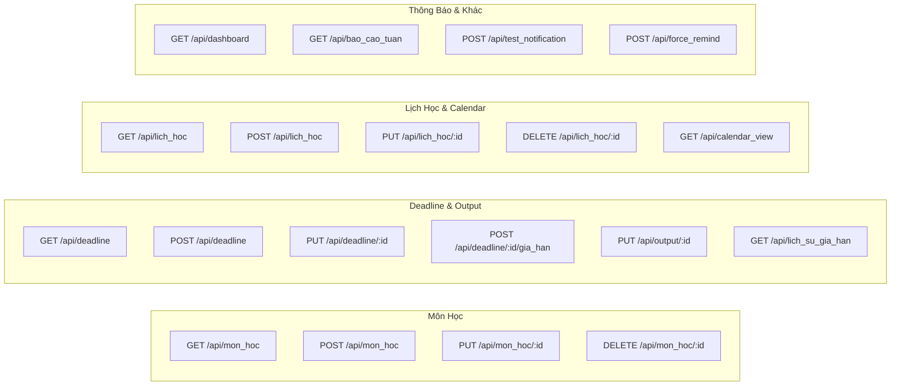

# 📚 BẢN ĐỒ KIẾN TRÚC HỆ THỐNG: UI, TRANG, ENDPOINT & CHỨC NĂNG
**Dự án:** AGY Study Manager (Hệ thống Quản lý Học tập & Deadline Cá nhân)  
**Công nghệ:** Flask, SQLite/Supabase PostgreSQL, APScheduler, ntfy.sh, Vanilla HTML5/CSS3/JS.

---

## 📑 MỤC LỤC
1. [Bản Đồ Trang & Giao Diện Người Dùng (UI / Tabs)](#1-bản-đồ-trang--giao-diện-người-dùng-ui--tabs)
2. [Danh Sách Các Modal Tương Tác (Popups & Forms)](#2-danh-sách-các-modal-tương-tác-popups--forms)
3. [Bản Đồ API Endpoints Toàn Hệ Thống](#3-bản-đồ-api-endpoints-toàn-hệ-thống)
4. [Bản Đồ Tính Năng Nghiệp Vụ Theo Use Case (UC01 - UC26)](#4-bản-đồ-tính-năng-nghiệp-vụ-theo-use-case-uc01---uc26)
5. [Quy Trình Tác Vụ Ngầm (Background Jobs & Push Notifications)](#5-quy-trình-tác-vụ-ngầm-background-jobs--push-notifications)

---

## 1. BẢN ĐỒ TRANG & GIAO DIỆN NGƯỜI DÙNG (UI / TABS)

Giao diện ứng dụng là **Single Page Application (SPA)** với Sidebar Navigation bên trái (hoặc Bottom Bar trên Mobile) và Header cố định phía trên.

```
┌─────────────────────────────────────────────────────────────────────────────────────────┐
│  [TOP HEADER]  Page Title  |  [+ Thêm Mới ▼] Quick Add Dropdown Menu                     │
├──────────────┬──────────────────────────────────────────────────────────────────────────┤
│  [SIDEBAR]   │  [PAGE CONTENT AREA]                                                     │
│  ■ Dashboard │  Chuyển đổi linh hoạt giữa 8 Tabs nội dung chính                         │
│  □ Môn học   │  - Thẻ tóm tắt chỉ số (Metrics Cards)                                    │
│  △ Deadline  │  - Bảng dữ liệu động (Data Tables)                                       │
│  ◆ Tài liệu  │  - Thanh tiến độ (Progress Bars)                                         │
│  ○ Nhật ký   │  - Banner cảnh báo quá tải & trễ hạn                                     │
│  ▶ Mục tiêu  │  - Thời khoá biểu tương tác đa góc nhìn (Tuần / Tháng)                   │
│  ▤ Báo cáo   │                                                                          │
│  ▭ Lịch học  │                                                                          │
└──────────────┴──────────────────────────────────────────────────────────────────────────┘
```

### Chi Tiết 8 Tabs Giao Diện

| Symbol | Tab Name | DOM ID | Thành Phần UI Chính | Chức Năng Hiển Thị |
|:---:|---|---|---|---|
| **■** | **Dashboard** | `#tab-dashboard` | • 3 Metric Cards (Deadline 7 ngày, Streak, Giờ tuần)<br>• Banners cảnh báo (Quá tải, Thiếu log, Trễ hạn)<br>• Bảng Deadline 7 ngày tới<br>• Tiến độ Mục tiêu cá nhân | Tổng quan trạng thái học tập theo thời gian thực; truy cập nhanh các task sắp đến hạn. |
| **□** | **Môn học** | `#tab-monhoc` | • Nút `+ Thêm Môn học mới`<br>• Bảng danh sách môn học (Trường / Tự học)<br>• Nút thao tác Soft-delete (Kết thúc môn) | Quản lý thông tin môn học, phân loại môn trường/tự học, giảng viên, tín chỉ, nguồn học. |
| **△** | **Deadline & Bài tập** | `#tab-deadline` | • Nút `+ Thêm Deadline mới`<br>• Bảng tất cả deadline (Mã, Tên, Hạn, Còn lại, Ưu tiên, Đặt bởi, Tiến độ, Trạng thái)<br>• Nút Cập nhật / Gia hạn | Theo dõi toàn bộ bài tập lớn, quiz, đồ án; xem tiến độ % và cập nhật trạng thái làm bài. |
| **◆** | **Tài liệu học tập** | `#tab-tailieu` | • Nút `+ Thêm Tài liệu mới`<br>• Bảng tài liệu (Mã, Môn, Tên, Loại, Link, Ngày thêm, Gợi ý ôn tập)<br>• Nút Xoá tài liệu | Lưu trữ link slide, sách, đề cương; nhắc nhở học lặp lại ngắt quãng (Spaced Repetition). |
| **○** | **Nhật ký thời gian** | `#tab-nhatky` | • Nút `+ Ghi nhận Giờ học mới`<br>• Bảng lịch sử ghi log (Mã, Ngày, Môn, Task, Giờ học, Độ tập trung, Ghi chú) | Ghi nhận thời gian học thực tế cho từng bài tập để duy trì chuỗi học tập liên tục (Streak). |
| **▶** | **Mục tiêu** | `#tab-muctieu` | • Nút `+ Thêm Mục tiêu mới`<br>• Bảng mục tiêu (Mã, Tên, Loại môn, Phân loại ngắn/dài hạn, Thời hạn, Hành động, Tiến độ, Trạng thái) | Đặt mục tiêu học tập theo học kỳ/năm và theo dõi % hoàn thành các bước hành động. |
| **▤** | **Báo cáo & Gia hạn** | `#tab-baocao` | • Panel kênh Push Notification (ntfy.sh Topic, nút test phone, nút force remind)<br>• Khung Báo cáo tuần tự động (UC16)<br>• Bảng Audit Log Lịch sử gia hạn deadline (UC07) | Quản lý kênh thông báo đẩy về điện thoại; xem báo cáo tổng kết tuần; xem lịch sử gia hạn task tự đặt. |
| **▭** | **Thời khóa biểu & Lịch** | `#tab-lichhoc` | • Thanh điều hướng (Tuần trước, Hôm nay, Tuần sau)<br>• Bộ chuyển View Tuần / View Tháng<br>• Pin Point Legend Bar<br>• Khung lưới Lịch tuần (7 cột) & Lịch tháng (Grid 7x5) | Thời khóa biểu trực quan kết hợp lịch học cố định, sự kiện 1 lần và deadline theo ngày (UC19–UC26). |

---

## 2. DANH SÁCH CÁC MODAL TƯƠNG TÁC (POPUPS & FORMS)

Tất cả modal đều hỗ trợ đóng bằng phím ESC, click ra ngoài overlay hoặc nút `×`.

```
               ┌────────────────────────────────────────────────────────┐
               │  TIÊU ĐỀ MODAL                                     [×] │
               ├────────────────────────────────────────────────────────┤
               │  [ Form Controls: Input, Select, Date, Slider... ]     │
               │  [ Error & Warning Validation Messages ]               │
               ├────────────────────────────────────────────────────────┤
               │                           [ Hủy ]  [ Nút Hành Động ]   │
               └────────────────────────────────────────────────────────┘
```

| ID Modal | Tên Modal | Các Trường Dữ Liệu (Inputs) | Hành Động Kích Hoạt |
|---|---|---|---|
| `modalAddMonHoc` | **Thêm Môn học Mới** | • Loại môn (Trường / Tự học toggle)<br>• Mã môn (`*`)<br>• Tên môn (`*`)<br>• Giảng viên & Số tín chỉ (nếu là Môn trường)<br>• Nguồn học & Checkbox tạo mục tiêu tự động (nếu là Tự học)<br>• Mức ưu tiên (Cao / TB / Thấp) | `POST /api/mon_hoc`<br>Tự động tạo MucTieu nếu tick chọn. |
| `modalAddDeadline` | **Thêm Deadline / Nhiệm vụ** | • Chọn môn học (`*`)<br>• Tên bài tập (`*`)<br>• Loại bài (Bài tập, Kiểm tra, Đồ án, Thuyết trình)<br>• Mức ưu tiên<br>• Ngày giao & Hạn nộp (`*`)<br>• Output mong muốn (`*` nếu là deadline Tự đặt)<br>• Link tài liệu nộp | `POST /api/deadline`<br>Tự động gửi push notification xác nhận về phone. |
| `modalUpdateStatus` | **Cập nhật Tiến độ Deadline** | • Trạng thái mới (Chưa làm / Đang làm / Hoàn thành)<br>• Slider % Hoàn thành (0 - 100%)<br>• Kết quả đạt được thực tế (cho môn Tự học)<br>• Tự đánh giá (Đạt / Chưa đạt / Cần làm lại)<br>• Box gợi ý gia hạn khi chưa đạt | `PUT /api/deadline/<id>`<br>`PUT /api/output/<id>` |
| `modalExtendDeadline` | **Gia hạn Deadline Tự Đặt** | • Hiển thị Hạn nộp cũ & Tên nhiệm vụ<br>• Hạn nộp mới (`*` > hạn cũ)<br>• Lý do gia hạn | `POST /api/deadline/<id>/gia_han`<br>Ghi audit log & gửi push notification. |
| `modalLogTime` | **Ghi nhận Thời gian Học** | • Chọn deadline liên quan (`*`)<br>• Ngày học<br>• Số giờ thực tế (`*` > 0)<br>• Mức độ tập trung (Tốt / TB / Xao nhãng)<br>• Ghi chú | `POST /api/nhat_ky`<br>Tính lại chuỗi ngày học liên tục (Streak). |
| `modalAddTaiLieu` | **Thêm Tài liệu Học tập** | • Môn học (tùy chọn)<br>• Tên tài liệu (`*`)<br>• Loại tài liệu<br>• Không đính kèm, link `http(s)`, hoặc upload PDF/Office/văn bản/hình ảnh | `POST /api/tai_lieu` |
| `modalAddMucTieu` | **Thêm Mục tiêu Cá nhân** | • Tên mục tiêu (`*`)<br>• Môn học liên quan (tuỳ chọn)<br>• Phân loại (Ngắn hạn / Dài hạn)<br>• Thời hạn<br>• Các bước hành động | `POST /api/muc_tieu` |
| `modalAddLichHoc` | **Thêm Lịch học / Sự kiện** | • Loại sự kiện (Lịch cố định / Sự kiện 1 lần)<br>• Môn học / Tên sự kiện (`*`)<br>• Thứ trong tuần (cho lịch lặp) hoặc Ngày cụ thể (cho sự kiện 1 lần)<br>• Giờ bắt đầu & Giờ kết thúc (`*`)<br>• Hình thức (Offline/Online) & Địa điểm/Link<br>• Ghi chú & Banner cảnh báo xung đột (Conflict Alert) | `POST /api/lich_hoc`<br>Tự động phát hiện trùng giờ (UC25). |
| `modalDayDetail` | **Chi tiết Ngày Hoạt động** | • Danh sách Lịch học trong ngày (kèm nút Xoá)<br>• Danh sách Deadline đến hạn trong ngày | Xem chi tiết khi click vào bất kỳ ô ngày trên Lịch / Pin Point dot. |

---

## 3. BẢN ĐỒ API ENDPOINTS TOÀN HỆ THỐNG

Tất cả endpoints được tổ chức theo cấu trúc **Flask Blueprints** chuẩn RESTful API.

```
                      ┌───────────────────────────────┐
                      │        FLASK APPLICATION      │
                      └───────┬───────────────┬───────┘
                              │               │
            ┌─────────────────┴────┐     ┌────┴─────────────────┐
            │   PAGE & HEALTHCHECK │     │   8 REST BLUEPRINTS  │
            │   GET /              │     │   routes/*.py        │
            │   GET /ping          │     └──────────────────────┘
            └──────────────────────┘
```

### Danh Mục 34 API Endpoints



| Method | Endpoint URI | Blueprint | Mô Tả Chức Năng | Status Codes |
|---|---|---|---|---|
| `GET` | `/` | Core | Trả về trang giao diện chính `index.html` | `200` |
| `GET` | `/ping` | Core | Healthcheck cho Railway / Cron-job chống ngủ | `200` |
| **Môn Học** | | | | |
| `GET` | `/api/mon_hoc` | `mon_hoc` | Lấy danh sách tất cả môn học | `200` |
| `POST` | `/api/mon_hoc` | `mon_hoc` | Tạo môn học mới (hỗ trợ tự tạo Mục tiêu) | `201`, `400` |
| `PUT` | `/api/mon_hoc/<ma_mon>` | `mon_hoc` | Cập nhật thông tin môn học | `200`, `400`, `404` |
| `DELETE`| `/api/mon_hoc/<ma_mon>` | `mon_hoc` | Soft-delete môn học (chuyển trạng thái `Da_xong`) | `200`, `404` |
| **Deadline & Output** | | | | |
| `GET` | `/api/deadline` | `deadline` | Lấy danh sách toàn bộ deadline | `200` |
| `POST` | `/api/deadline` | `deadline` | Tạo deadline mới (tự gửi Push Notification) | `201`, `400`, `404` |
| `PUT` | `/api/deadline/<ma_bai_tap>` | `deadline` | Cập nhật trạng thái và % tiến độ | `200`, `404` |
| `POST` | `/api/deadline/<ma_bai_tap>/gia_han` | `deadline` | Gia hạn deadline tự đặt (tạo audit log) | `200`, `400`, `404` |
| `PUT` | `/api/output/<ma_output>` | `deadline` | Ghi nhận kết quả và tự đánh giá output tự học | `200`, `404` |
| `GET` | `/api/lich_su_gia_han` | `deadline` | Lấy toàn bộ lịch sử gia hạn audit logs | `200` |
| **Nhật Ký & Thời Gian** | | | | |
| `GET` | `/api/nhat_ky` | `nhat_ky` | Lấy danh sách lịch sử ghi log giờ học | `200` |
| `POST` | `/api/nhat_ky` | `nhat_ky` | Ghi nhận giờ học mới & trả về Streak cập nhật | `201`, `400` |
| **Tài Liệu Học Tập** | | | | |
| `GET` | `/api/tai_lieu` | `tai_lieu` | Lấy kho tài liệu học tập | `200` |
| `POST` | `/api/tai_lieu` | `tai_lieu` | Thêm tài liệu mới | `201`, `400` |
| `DELETE`| `/api/tai_lieu/<ma_tai_lieu>` | `tai_lieu` | Xóa tài liệu khỏi kho | `200`, `404` |
| **Mục Tiêu** | | | | |
| `GET` | `/api/muc_tieu` | `muc_tieu` | Lấy danh sách mục tiêu cá nhân | `200` |
| `POST` | `/api/muc_tieu` | `muc_tieu` | Tạo mục tiêu mới | `201`, `400` |
| `PUT` | `/api/muc_tieu/<ma_muc_tieu>` | `muc_tieu` | Cập nhật tiến độ % và trạng thái mục tiêu | `200`, `404` |
| **Thời Khóa Biểu & Lịch** | | | | |
| `GET` | `/api/lich_hoc` | `lich_hoc` | Lấy danh sách lịch học & sự kiện | `200` |
| `POST` | `/api/lich_hoc` | `lich_hoc` | Tạo lịch học / sự kiện mới (kèm conflict detect) | `201`, `400`, `409` |
| `PUT` | `/api/lich_hoc/<ma_lich>` | `lich_hoc` | Cập nhật thời gian, địa điểm lịch học | `200`, `404` |
| `DELETE`| `/api/lich_hoc/<ma_lich>` | `lich_hoc` | Xóa lịch học / sự kiện | `200`, `404` |
| `GET` | `/api/calendar_view` | `lich_hoc` | Overlay dữ liệu Lịch học + Deadline theo ngày | `200` |
| **Dashboard & Báo Cáo** | | | | |
| `GET` | `/api/dashboard` | `dashboard` | Tổng hợp toàn bộ dữ liệu chỉ số cho Dashboard | `200` |
| `GET` | `/api/bao_cao_tuan` | `dashboard` | Tổng hợp dữ liệu báo cáo tuần (UC16) | `200` |
| `GET` | `/api/export` | `dashboard` | Export toàn bộ database dưới dạng JSON (UC18) | `200` |
| **Thông Báo & Debug** | | | | |
| `POST` | `/api/test_notification` | `notifications` | Gửi tin nhắn test tới điện thoại qua ntfy | `200`, `500` |
| `POST` | `/api/trigger_uc_notification/<uc>`| `notifications` | Kích hoạt thủ công từng scheduled job | `200`, `400` |
| `POST` | `/api/force_remind` | `notifications` | Bỏ qua dedup, bắn nhắc nhở tức thì | `200` |
| `GET/POST`| `/api/ntfy_config` | `notifications` | Lấy hoặc đổi topic ntfy.sh | `200`, `400` |
| `GET` | `/api/log_loi` | `notifications` | Xem danh sách log lỗi hệ thống (UC07) | `200` |

---

## 4. BẢN ĐỒ TÍNH NĂNG NGHIỆP VỤ THEO USE CASE (UC01 - UC26)

| Nhóm Tính Năng | Mã UC | Tên Use Case | Thành Phần Thực Hiện | Mô Tả Nghiệp Vụ |
|---|---|---|---|---|
| **Quản Lý Môn Học** | `UC01` | Tạo môn học thuộc trường | `MonHocService.create` | Bắt buộc Giảng viên & Số tín chỉ. |
| | `UC02` | Tạo môn tự học | `MonHocService.create` | Bắt buộc Nguồn học; tuỳ chọn tạo MucTieu tương ứng. |
| | `UC03` | Cập nhật môn học | `MonHocService.update` | Sửa thông tin môn; soft-delete chuyển `Da_xong`. |
| **Quản Lý Deadline** | `UC04` | Nhập deadline mới | `DeadlineService.create` | Môn tự học bắt buộc Output mong muốn; gửi push notif. |
| | `UC05` | Cập nhật tiến độ | `DeadlineService.update_status` | Cập nhật % và trạng thái (`Dang_lam`, `Hoan_thanh`). |
| | `UC06` | Gia hạn deadline tự đặt | `DeadlineService.extend` | Chỉ áp dụng task tự đặt; tăng `so_lan_gia_han` & ghi audit log. |
| | `UC07` | Ghi log lỗi & Audit log | `LogLoi`, `LichSuGiaHan` | Theo dõi lịch sử thao tác và lỗi gửi tin. |
| | `UC08` | Đánh giá Output tự học | `DeadlineService.update_output` | Ghi kết quả đạt được, tự đánh giá Đạt/Chưa đạt. |
| **Tài Liệu & Ôn Tập** | `UC09` | Lưu trữ tài liệu | `TaiLieuService.create` | Lưu link slide, sách, đề cương theo từng môn. |
| | `UC10` | Spaced Repetition | `TaiLieuService.check_spaced_repetition` | Nhắc ôn tập ngắt quãng theo mốc 1, 3, 7, 14, 30 ngày. |
| **Nhật Ký Học Tập** | `UC11` | Ghi nhận thời gian | `NhatKyService.create` | Ghi số giờ thực tế, độ tập trung, ghi chú cho task. |
| | `UC12` | Tính toán Streak | `NhatKyService.calculate_streak` | Đếm số ngày liên tục có ghi nhận giờ học. |
| **Nhắc Nhở & Cảnh Báo**| `UC13` | Nhắc Deadline tự động | `jobs.nhac_deadline` | Chạy 6 tiếng/lần (07:00, 13:00, 19:00, 01:00) nhắc mốc 0, 1, 2 ngày. |
| | `UC14` | Nhắc nhập liệu giờ học | `jobs.nhac_nhap_lieu` | 20:00 hàng ngày nhắc task chưa ghi log 2–3 ngày. |
| | `UC15` | Cảnh báo quá tải | `jobs.canh_bao_qua_tai` | 07:05 hàng ngày cảnh báo khi ≥3 deadline trùng ngày. |
| | `UC16` | Báo cáo tuần tự động | `jobs.bao_cao_tuan` | Chủ nhật 21:00 tổng kết số task hoàn thành & giờ học. |
| **Dashboard & Export** | `UC17` | Tổng quan Dashboard | `dashboard_service.get_dashboard_data` | Tập hợp metrics, banners, deadline 7 ngày, tiến độ mục tiêu. |
| | `UC18` | Xuất dữ liệu JSON | `routes.dashboard_routes.export_data` | Export toàn bộ database thành 1 file JSON sao lưu. |
| **Thời Khóa Biểu & Lịch**| `UC19` | Lịch học cố định lặp lại | `LichHocService.create` | Lịch học theo thứ trong tuần (T2-CN) lặp lại hàng tuần. |
| | `UC20` | Sự kiện học tập 1 lần | `LichHocService.create` | Sự kiện theo ngày cụ thể (Thi, Bảo vệ đồ án). |
| | `UC21` | Xem Lịch dạng Tuần | `LichHocService.get_calendar_view` | Lưới 7 cột từ Thứ 2 đến Chủ nhật. |
| | `UC22` | Chuyển đổi Tuần trước/sau| `app.js (navigateCalendarPeriod)` | Lật trang tuần động mà không load lại trang. |
| | `UC23` | Xem chi tiết sự kiện | `modalDayDetail` | Click vào ô ngày hoặc Pin point để xem chi tiết & xóa. |
| | `UC24` | Xem Lịch dạng Tháng | `app.js (renderMonthlyCalendarView)` | Lưới ô 7x5 bao quát toàn bộ sự kiện trong tháng. |
| | `UC25` | Phát hiện xung đột giờ | `LichHocService._detect_conflict` | Báo động khi tạo 2 lịch học bị trùng khung giờ (`409 Conflict`). |
| | `UC26` | Đánh dấu Pin Points | `app.js (renderPinPoints)` | Hiển thị chấm màu trực quan: Xanh (Cố định), Đỏ (Ưu tiên cao), Cam (TB/Thấp), Tím (1 lần). |

---

## 5. QUY TRÌNH TÁC VỤ NGẦM (BACKGROUND JOBS & PUSH NOTIFICATIONS)

Hệ thống sử dụng **APScheduler** chạy nền song song với Flask, tự động quét và gửi push notification về ứng dụng **ntfy** trên điện thoại:

```
[ APScheduler Background Thread ]
  │
  ├─► [07:00, 13:00, 19:00, 01:00] ──► UC13: Quét & gửi nhắc nhở Deadline (Hạn hôm nay, còn 1, 2 ngày, trễ hạn)
  ├─► [07:05 Hàng ngày]              ──► UC15: Quét & gửi Cảnh báo quá tải (≥3 task trùng ngày)
  ├─► [08:00 Hàng ngày]              ──► UC10: Quét tài liệu đạt mốc Spaced Repetition (1, 3, 7, 14, 30 ngày)
  ├─► [20:00 Hàng ngày]              ──► UC14: Quét & nhắc ghi nhận giờ học cho các task đang làm
  └─► [Chủ Nhật 21:00]               ──► UC16: Tạo & gửi Báo cáo học tập tổng kết tuần
```
