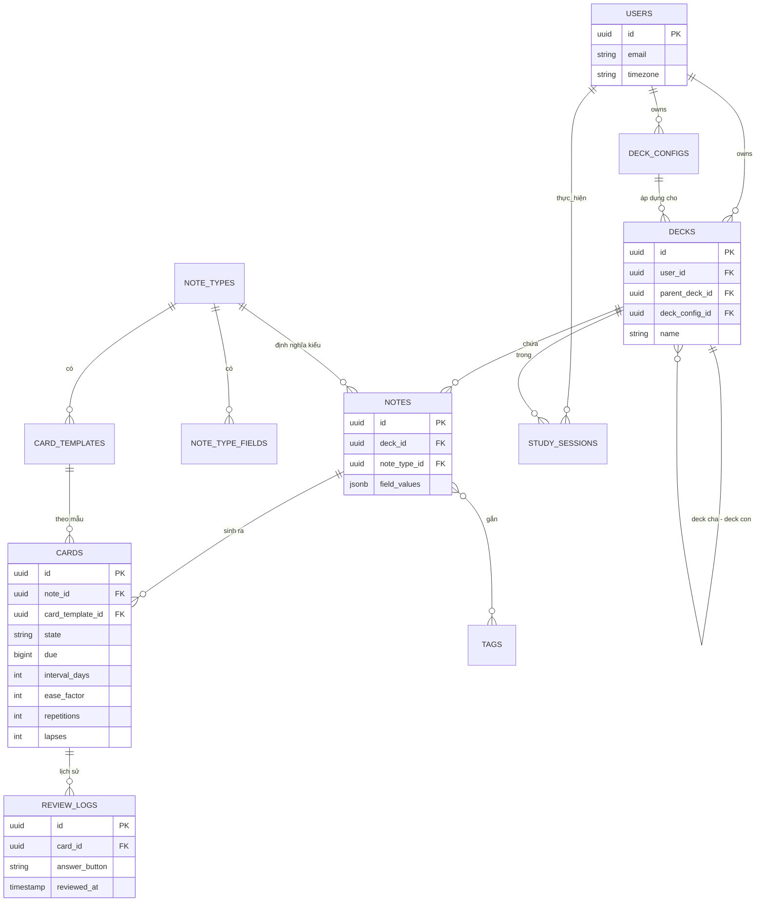
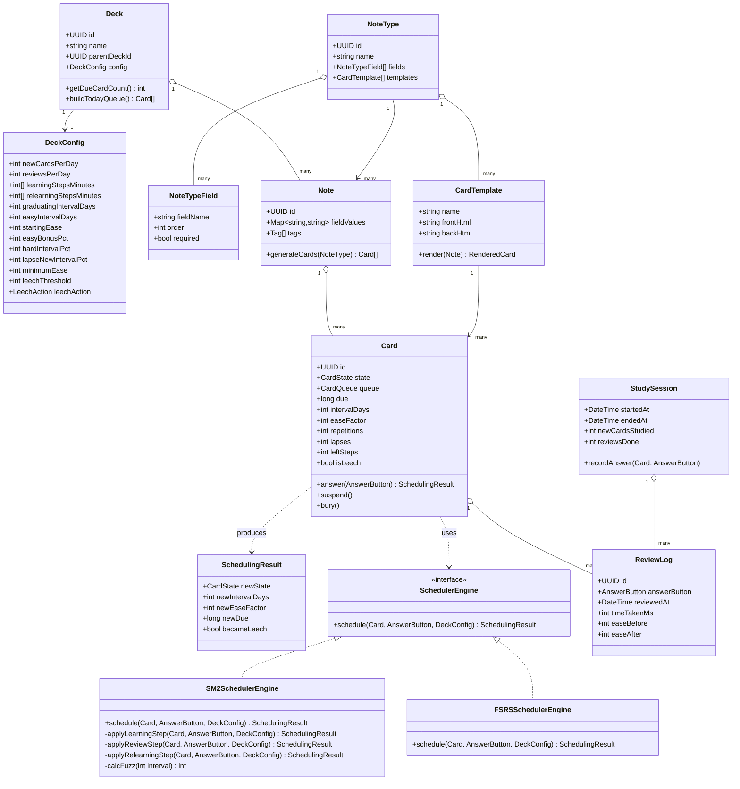
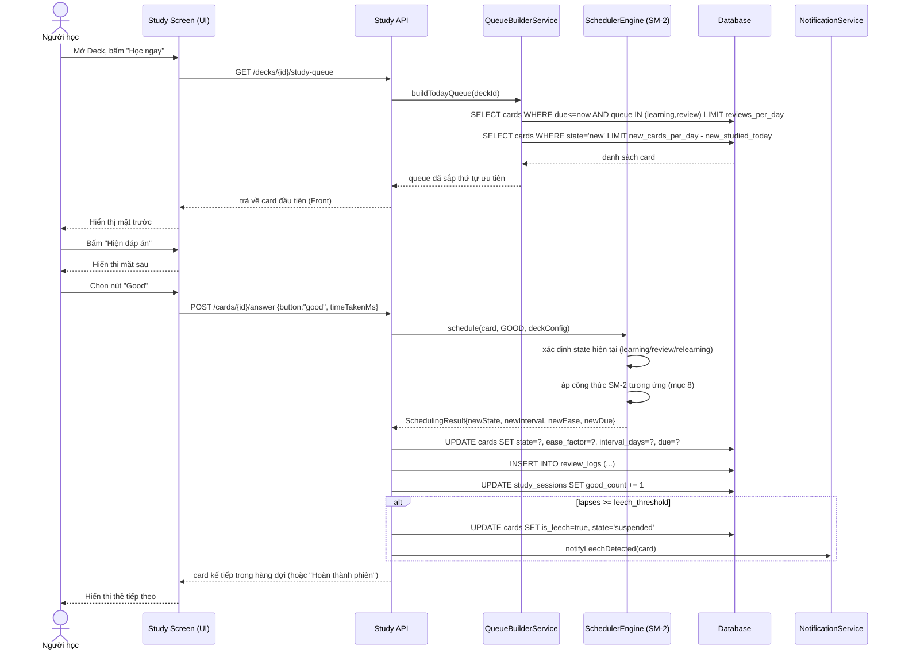
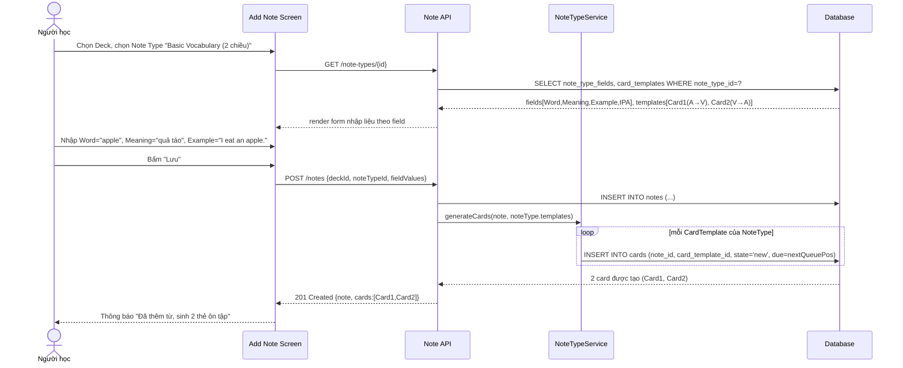
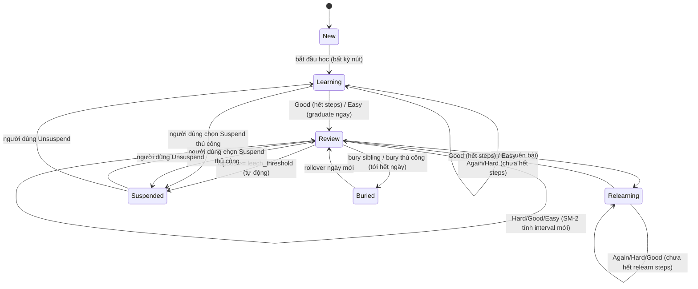

# TÀI LIỆU THIẾT KẾ USE CASE — MODULE HỌC TỪ VỰNG THEO SPACED REPETITION
### (Mô phỏng cơ chế lịch ôn tập của Anki — nền tảng thuật toán SM-2)

---

## MỤC LỤC
1. [Tổng quan & phạm vi](#1-tổng-quan--phạm-vi)
2. [Kiến thức nền: Cơ chế Spaced Repetition trong Anki](#2-kiến-thức-nền-cơ-chế-spaced-repetition-trong-anki)
3. [Danh sách Use Case](#3-danh-sách-use-case)
4. [Đặc tả chi tiết từng Use Case](#4-đặc-tả-chi-tiết-từng-use-case)
5. [Thiết kế Database (ERD + Schema chi tiết)](#5-thiết-kế-database-erd--schema-chi-tiết)
6. [Class Diagram](#6-class-diagram)
7. [Sequence Diagram](#7-sequence-diagram)
8. [Thuật toán lập lịch chi tiết (Scheduling Algorithm)](#8-thuật-toán-lập-lịch-chi-tiết-scheduling-algorithm)
9. [Thiết kế UI (Wireframe mô tả)](#9-thiết-kế-ui-wireframe-mô-tả)
10. [Luồng nghiệp vụ tổng hợp (state machine của 1 thẻ)](#10-luồng-nghiệp-vụ-tổng-hợp-state-machine-của-1-thẻ)
11. [Các quy tắc nghiệp vụ (Business Rules) bám sát Anki](#11-các-quy-tắc-nghiệp-vụ-business-rules-bám-sát-anki)

---

## 1. TỔNG QUAN & PHẠM VI

Module "Học từ vựng" nằm trong app tự học tập kết hợp planner. Mục tiêu: cho phép người dùng
tạo bộ từ vựng (Deck), thêm từ (Note/Card), và ôn tập theo cơ chế **Spaced Repetition** giống hệt
luồng nghiệp vụ của Anki:

- Có khái niệm **Note** (nội dung gốc: từ, nghĩa, ví dụ, âm thanh, ảnh) và **Card** (một "lượt học"
  sinh ra từ Note theo Note Type/Template — ví dụ 1 note "apple" có thể sinh 2 card: card 1 hỏi
  Anh→Việt, card 2 hỏi Việt→Anh).
- Mỗi Card có **trạng thái vòng đời**: `New → Learning → Review ⇄ Relearning`, kèm `Suspended`,
  `Buried`.
- Lịch ôn dựa trên thuật toán nền **SM-2** (do Piotr Wozniak phát triển năm 1987), được Anki tùy
  biến thêm (learning steps, ease tối thiểu 130%, fuzz ngẫu nhiên, leech, burying...).
- Người dùng chấm điểm nhớ bằng 4 nút: **Again / Hard / Good / Easy** sau mỗi lần xem thẻ.
- Có hàng đợi ôn tập mỗi ngày (New queue, Learning queue, Review queue) với giới hạn cấu hình
  (new cards/day, reviews/day).

**Không thuộc phạm vi tài liệu này:** đồng bộ đa thiết bị (sync), AI sinh câu ví dụ, nhận diện
giọng nói phát âm — có thể mở rộng ở phiên bản sau.

---

## 2. KIẾN THỨC NỀN: CƠ CHẾ SPACED REPETITION TRONG ANKI

Để "mô phỏng chính xác" Anki, cần nắm đúng các khái niệm lõi sau:

### 2.1. Note vs Card
- **Note**: đơn vị dữ liệu gốc (Front, Back, Example, Audio...). Một Note gắn với một **Note Type**
  (kiểu ghi chú) định nghĩa các field và các template sinh card.
- **Card**: một "lượt kiểm tra trí nhớ" cụ thể, tham chiếu tới 1 Note + 1 Template. Card là đơn vị
  được lập lịch ôn tập (mỗi Card có ease, interval, due date riêng), **không phải Note**.

### 2.2. Ba loại hàng đợi (Queue) mỗi ngày
| Queue | Ý nghĩa |
|---|---|
| **New** | Thẻ chưa học lần nào, giới hạn bởi `new_cards_per_day` |
| **Learning/Relearning** | Thẻ đang trong chuỗi bước học ngắn hạn (tính bằng phút/giờ) |
| **Review** | Thẻ đã "tốt nghiệp" (graduated), lịch ôn tính bằng ngày, giới hạn bởi `reviews_per_day` |

### 2.3. Vòng đời một Card (State Machine)
```
        [New]
          │ bắt đầu học lần đầu
          ▼
     [Learning] ──(Again)──► lặp lại bước học đầu
          │ hoàn thành hết learning steps hoặc bấm Easy
          ▼
      [Review] ◄────────────────┐
          │  (Again = quên bài) │
          ▼                     │ hoàn thành relearning steps
    [Relearning] ────────────────┘
```
Ngoài ra còn 2 trạng thái phụ: **Suspended** (tạm ẩn khỏi hàng đợi, không tính due) và
**Buried** (ẩn tới hết ngày hôm đó — áp dụng khi 1 note sinh nhiều card, tránh học 2 card
cùng note liên tiếp trong 1 ngày).

### 2.4. Bốn nút đánh giá (Answer Buttons)
| Nút | Ý nghĩa | Điểm quy đổi SM-2 (0–5) |
|---|---|---|
| **Again** | Quên hoàn toàn | 0–2 (fail) |
| **Hard** | Nhớ nhưng rất khó khăn | 3 |
| **Good** | Nhớ đúng, bình thường | 4 |
| **Easy** | Nhớ dễ dàng | 5 |

### 2.5. Công thức SM-2 gốc (nền tảng thuật toán Anki dùng cho pha Review)
Với mỗi Card lưu 3 biến trạng thái: `repetitions (n)`, `ease_factor (EF)`, `interval (I)`.

- **EF khởi tạo** = 2.5 (250%), **EF tối thiểu** = 1.3 (130%) — Anki không cho ease giảm dưới
  130% vì SuperMemo nghiên cứu thấy ease quá thấp khiến thẻ due quá thường xuyên, gây phiền.
- Sau mỗi lần trả lời với điểm chất lượng `q` (0–5), cập nhật:

```
EF' = EF + (0.1 − (5 − q) × (0.08 + (5 − q) × 0.02))
EF' = max(EF', 1.3)
```

- Nếu q ≥ 3 (Hard/Good/Easy — trả lời đúng):
```
n = 0  → I = 1 ngày         (lần học đầu graduate)
n = 1  → I = 6 ngày         (khoảng "graduating interval")
n > 1  → I = round(I_prev × EF')
repetitions += 1
```
- Nếu q < 3 (Again — trả lời sai):
```
repetitions = 0
Card chuyển sang Relearning, I_relearn = I_prev × lapse_multiplier (mặc định 0.1, tối thiểu 1 ngày)
EF' = max(EF − 0.20, 1.3)   // Anki: Again trừ 20 điểm % ease
```

### 2.6. Các tinh chỉnh Anki thêm vào so với SM-2 gốc
1. **Learning steps** (mặc định `1m 10m`): thẻ New/Relearning đi qua các bước ngắn tính bằng phút
   trước khi "tốt nghiệp" (graduate) thành Review card. Bấm *Again* → quay lại bước 1; bấm *Good*
   → sang bước kế; bấm *Easy* → graduate ngay lập tức với "Easy Interval" (mặc định 4 ngày).
2. **Hard** trong pha Review: `I' = round(I_prev × 1.2)`, ease giảm 15 điểm %, không reset chuỗi.
3. **Easy** trong pha Review: `I' = round(I_prev × EF' × easy_bonus)` (easy_bonus mặc định 1.3),
   ease tăng thêm 15 điểm %.
4. **Fuzz (nhiễu ngẫu nhiên)**: interval cuối cùng được cộng/trừ ngẫu nhiên 5–15% để tránh nhiều
   thẻ dồn cùng 1 ngày due.
5. **Interval tối thiểu tăng dần**: interval mới (trừ trường hợp Again) luôn ≥ interval cũ + 1 ngày.
6. **Maximum interval**: interval bị chặn trần (mặc định 36500 ngày ~100 năm).
7. **Leech**: nếu số lần *Again* (lapses) của 1 thẻ vượt ngưỡng (mặc định 8 lần), thẻ được gắn tag
   "leech" và tự động **Suspended** để người dùng xem lại cách học/nội dung thẻ.
8. **Burying**: các card sinh từ cùng 1 note, khi 1 card được trả lời trong ngày thì các card anh em
   còn lại bị bury tới hôm sau (tùy chọn bật/tắt).
9. Việc trả lời muộn hơn lịch (late review) vẫn được tính vào công thức, thẻ trả lời muộn nhưng vẫn
   nhớ đúng sẽ được "thưởng" khoảng ôn dài hơn một chút.

> **Ghi chú:** Từ Anki 23.10 trở đi có thêm bộ lập lịch **FSRS** (mô hình hoá Difficulty/Stability/
> Retrievability, tối ưu hơn SM-2 khoảng 20–30% số lượt ôn) nhưng SM-2 vẫn là bộ lập lịch mặc định
> lâu đời và dễ triển khai. Tài liệu này thiết kế theo **SM-2 kiểu Anki** làm engine chính (V1),
> đồng thời thiết kế schema đủ mở để nâng cấp sang FSRS ở V2 (xem mục 5.6).

---

## 3. DANH SÁCH USE CASE

| Mã UC | Tên Use Case | Actor chính | Mô tả ngắn |
|---|---|---|---|
| UC-01 | Quản lý bộ từ vựng (Deck) | Người học | Tạo/sửa/xóa/import Deck |
| UC-02 | Quản lý kiểu thẻ (Note Type) | Người học | Định nghĩa field & template sinh card |
| UC-03 | Thêm từ vựng (Add Note) | Người học | Nhập từ, nghĩa, ví dụ → hệ thống sinh Card |
| UC-04 | Import/Export từ vựng | Người học | Nhập từ file CSV/Excel hoặc chia sẻ deck |
| UC-05 | Học từ mới (Learn New Cards) | Người học | Học các thẻ New lần đầu, qua learning steps |
| UC-06 | Ôn tập hàng ngày (Review Session) | Người học | Ôn các thẻ đến hạn (due) trong Review queue |
| UC-07 | Chấm điểm ghi nhớ & lập lịch lại | Hệ thống | Tính lại ease/interval/due date sau mỗi lượt trả lời |
| UC-08 | Xử lý thẻ khó nhớ (Leech handling) | Hệ thống | Tự động gắn tag leech, tạm ẩn thẻ |
| UC-09 | Tạm dừng / Bỏ qua thẻ (Suspend/Bury) | Người học | Ẩn thẻ tạm thời hoặc vĩnh viễn |
| UC-10 | Xem thống kê & lịch ôn (Stats & Calendar heatmap) | Người học | Biểu đồ tiến độ, forecast số thẻ due |
| UC-11 | Cấu hình Deck Options | Người học | Tùy chỉnh new/day, learning steps, ease... |
| UC-12 | Tìm kiếm & duyệt thẻ (Browse) | Người học | Tìm, sửa, xóa thẻ hàng loạt |
| UC-13 | Đồng bộ với Planner | Người học | Đưa "phiên ôn tập" vào lịch học tổng (planner) |
| UC-14 | Nhắc nhở ôn tập (Notification) | Hệ thống | Push notification khi có thẻ due |

**Sơ đồ Use Case (mô tả dạng text UML):**
```
                    ┌───────────────────────────┐
                    │        Người học           │
                    └──────────┬────────────────┘
        ┌───────┬───────┬──────┼──────┬────────┬─────────┬─────────┐
        ▼       ▼       ▼      ▼      ▼        ▼         ▼         ▼
     UC-01   UC-02   UC-03  UC-05   UC-06    UC-09     UC-10     UC-12
   (Deck) (NoteType)(Add) (Learn) (Review) (Suspend) (Stats)  (Browse)
                                     │
                         <<include>> │ <<include>>
                                     ▼
                                  UC-07 (Chấm điểm & lập lịch) ── actor: Hệ thống
                                     │
                          <<extend>> ▼
                                  UC-08 (Leech handling) ── actor: Hệ thống

                    ┌───────────────────────────┐
                    │          Hệ thống          │──► UC-14 (Notification)
                    └───────────────────────────┘
```

---

## 4. ĐẶC TẢ CHI TIẾT TỪNG USE CASE

### UC-05: Học từ mới (Learn New Cards)

| Thuộc tính | Nội dung |
|---|---|
| **Actor** | Người học |
| **Tiền điều kiện** | Deck tồn tại, còn quota `new_cards_per_day` chưa dùng hết trong ngày |
| **Trigger** | Người dùng mở Deck → bấm "Học" |
| **Luồng chính** | 1. Hệ thống lấy N thẻ trạng thái `New` (N ≤ `new_per_day − new_studied_today`), sắp theo thứ tự tạo (hoặc random tùy cấu hình).<br>2. Hiển thị mặt trước (Front) của thẻ đầu tiên.<br>3. Người dùng bấm "Hiện đáp án" → hiển thị mặt sau (Back).<br>4. Người dùng chọn 1 trong 4 nút Again/Hard/Good/Easy.<br>5. Hệ thống gọi **UC-07** để tính bước học kế tiếp (learning step) và due time (tính bằng phút).<br>6. Nếu còn learning step → thẻ quay lại hàng đợi Learning trong phiên hiện tại (due trong vài phút) hoặc hôm sau.<br>7. Nếu Easy hoặc hoàn thành hết learning steps → thẻ **graduate**, chuyển trạng thái `Review`, interval = 1 hoặc 4 ngày.<br>8. Lặp lại bước 2–7 cho tới khi hết thẻ New trong quota hoặc người dùng dừng. |
| **Luồng phụ** | 4a. Người dùng bấm Again nhiều lần liên tiếp (> ngưỡng) → có thể hệ thống gợi ý "Đánh dấu từ khó" (tiền đề cho leech). |
| **Hậu điều kiện** | `new_studied_today += số thẻ đã học`; các thẻ được cập nhật trạng thái + due; ReviewLog được ghi. |

### UC-06: Ôn tập hàng ngày (Review Session)

| Thuộc tính | Nội dung |
|---|---|
| **Actor** | Người học |
| **Tiền điều kiện** | Có ít nhất 1 thẻ ở trạng thái `Review`/`Relearning`/`Learning` có `due_date ≤ now` |
| **Luồng chính** | 1. Hệ thống build hàng đợi ôn ngày: gộp (Learning due trong hôm nay) + (Review due ≤ hôm nay, giới hạn `reviews_per_day`) theo thứ tự ưu tiên: Learning > Review quá hạn lâu nhất trước.<br>2. Hiển thị Front thẻ.<br>3. Người dùng lật thẻ xem Back.<br>4. Người dùng chấm điểm (Again/Hard/Good/Easy).<br>5. Gọi **UC-07** tính lại ease/interval/due_date theo công thức SM-2 pha Review (mục 2.5–2.6).<br>6. Nếu Again → thẻ chuyển `Relearning`, đưa vào lại hàng đợi hôm nay (theo learning steps của relearning, mặc định `10m`).<br>7. Cập nhật `ReviewLog` (lưu lịch sử: thời điểm, nút bấm, ease trước/sau, interval trước/sau, thời gian trả lời).<br>8. Lặp tới khi hết hàng đợi. |
| **Ngoại lệ** | Nếu số lần Again của thẻ vượt `leech_threshold` → kích hoạt **UC-08**. |
| **Hậu điều kiện** | Toàn bộ thẻ due hôm nay được cập nhật lịch ôn mới; thống kê ngày học được ghi vào `study_session`. |

### UC-07: Chấm điểm ghi nhớ & lập lịch lại (Core Scheduling — <<include>>)

| Thuộc tính | Nội dung |
|---|---|
| **Actor** | Hệ thống (được include bởi UC-05, UC-06) |
| **Input** | `card_id`, `answer_button` (Again/Hard/Good/Easy), `time_taken_ms` |
| **Xử lý** | Xem chi tiết thuật toán ở **Mục 8**. Tóm tắt: xác định trạng thái hiện tại của card → áp dụng đúng nhánh công thức (Learning-step / Review-SM2 / Relearning) → tính `new_ease`, `new_interval`, `new_due`, `new_state`, `lapses`. |
| **Output** | Card được `UPDATE` với state/ease/interval/due mới; 1 dòng `review_log` mới được `INSERT`. |

### UC-08: Xử lý thẻ khó nhớ (Leech Handling — <<extend>> UC-06)

| Thuộc tính | Nội dung |
|---|---|
| **Điều kiện kích hoạt** | `card.lapses ≥ deck_config.leech_threshold` (mặc định 8) |
| **Luồng** | 1. Hệ thống gắn tag `leech` vào Note.<br>2. Theo `leech_action` cấu hình: `suspend` (mặc định, ẩn khỏi hàng đợi) hoặc `tag_only` (chỉ đánh dấu, vẫn học tiếp).<br>3. Hiển thị thông báo nhỏ "Từ này bạn hay quên — đã tạm ẩn, vào Browse để chỉnh sửa/ôn riêng". |

### UC-11: Cấu hình Deck Options

Các tham số **bám sát đúng Anki**, cho phép người dùng tùy biến theo nhóm Deck (Preset):

| Tham số | Mặc định | Ý nghĩa |
|---|---|---|
| `new_cards_per_day` | 20 | Số thẻ mới/ngày |
| `reviews_per_day` | 200 | Trần số thẻ Review/ngày |
| `learning_steps` | `1m 10m` | Các bước học (phút) trước khi graduate |
| `relearning_steps` | `10m` | Các bước học lại khi quên thẻ Review |
| `graduating_interval` | 1 ngày | Interval khi graduate bằng Good |
| `easy_interval` | 4 ngày | Interval khi graduate bằng Easy |
| `starting_ease` | 250% | Ease factor khởi tạo |
| `easy_bonus` | 130% | Hệ số nhân thêm khi bấm Easy ở pha Review |
| `interval_modifier` | 100% | Hệ số nhân toàn cục lên mọi interval |
| `hard_interval_multiplier` | 120% | Hệ số khi bấm Hard ở pha Review |
| `lapse_new_interval` | 10% (tối thiểu 1 ngày) | Interval mới khi Again ở pha Review |
| `minimum_ease` | 130% | Ease sàn |
| `leech_threshold` | 8 lần quên | Ngưỡng đánh dấu leech |
| `leech_action` | Suspend | Hành động khi thành leech |
| `bury_siblings` | true | Ẩn các card cùng note tới hôm sau |
| `fuzz_factor` | ±5–15% | Nhiễu ngẫu nhiên chống dồn ngày due |

---

## 5. THIẾT KẾ DATABASE (ERD + SCHEMA CHI TIẾT)

### 5.1. Sơ đồ ERD (mô tả quan hệ)
```
User (1) ──── (N) Deck
Deck (1) ──── (N) DeckConfig            [1 config có thể áp cho nhiều Deck: N–1]
Deck (1) ──── (N) Note
NoteType (1) ── (N) Note
NoteType (1) ── (N) NoteTypeField
NoteType (1) ── (N) CardTemplate
Note (1) ──── (N) Card
CardTemplate (1) ─ (N) Card
Card (1) ──── (N) ReviewLog
Note (N) ──── (N) Tag   [qua bảng note_tag]
User (1) ──── (N) StudySession
StudySession (1) ─ (N) ReviewLog  (tuỳ chọn liên kết phiên học)
```

### 5.2. Schema chi tiết từng bảng

#### `users`
| Cột | Kiểu | Ghi chú |
|---|---|---|
| id | UUID (PK) | |
| email | varchar(255) unique | |
| display_name | varchar(100) | |
| timezone | varchar(50) | dùng để tính "ngày học" (day rollover, mặc định 4h sáng như Anki) |
| day_start_hour | int, default 4 | giờ bắt đầu ngày mới (Anki cho phép chỉnh) |
| created_at | timestamp | |

#### `decks`
| Cột | Kiểu | Ghi chú |
|---|---|---|
| id | UUID (PK) | |
| user_id | UUID (FK → users.id) | |
| name | varchar(150) | |
| parent_deck_id | UUID (FK → decks.id, nullable) | hỗ trợ deck lồng nhau `Deck::Subdeck` |
| deck_config_id | UUID (FK → deck_configs.id) | |
| description | text | |
| is_archived | boolean default false | |
| created_at | timestamp | |

#### `deck_configs`  *(preset cấu hình lịch ôn — mục 4/UC-11)*
| Cột | Kiểu | Mặc định |
|---|---|---|
| id | UUID (PK) | |
| user_id | UUID (FK) | |
| name | varchar(100) | "Default" |
| new_cards_per_day | int | 20 |
| reviews_per_day | int | 200 |
| learning_steps | varchar(50) | `"1m 10m"` |
| relearning_steps | varchar(50) | `"10m"` |
| graduating_interval_days | int | 1 |
| easy_interval_days | int | 4 |
| starting_ease | int (basis point, 250 = 250%) | 250 |
| easy_bonus_pct | int | 130 |
| hard_interval_pct | int | 120 |
| interval_modifier_pct | int | 100 |
| lapse_new_interval_pct | int | 10 |
| minimum_ease | int | 130 |
| maximum_interval_days | int | 36500 |
| leech_threshold | int | 8 |
| leech_action | enum('suspend','tag_only') | suspend |
| bury_siblings | boolean | true |
| new_card_order | enum('added_order','random') | added_order |

#### `note_types` *(giống "Note Type" của Anki, vd: "Basic", "Basic (2 chiều)")*
| Cột | Kiểu | Ghi chú |
|---|---|---|
| id | UUID (PK) | |
| user_id | UUID (FK) | |
| name | varchar(100) | vd: "Basic Vocabulary" |
| created_at | timestamp | |

#### `note_type_fields` *(các field của 1 note type, vd Word/Meaning/Example/IPA/Audio)*
| Cột | Kiểu | Ghi chú |
|---|---|---|
| id | UUID (PK) | |
| note_type_id | UUID (FK) | |
| field_name | varchar(50) | "Word","Meaning","Example","IPA","AudioUrl","ImageUrl" |
| field_order | int | thứ tự hiển thị |
| is_required | boolean | |

#### `card_templates` *(định nghĩa Front/Back template, quyết định số Card sinh ra từ 1 Note)*
| Cột | Kiểu | Ghi chú |
|---|---|---|
| id | UUID (PK) | |
| note_type_id | UUID (FK) | |
| template_name | varchar(100) | vd "Card 1: Anh→Việt", "Card 2: Việt→Anh" |
| front_html | text | template chứa placeholder `{{Word}}` |
| back_html | text | template chứa `{{FrontSide}}` + `{{Meaning}}`... |
| card_order | int | |

#### `notes` *(dữ liệu 1 từ vựng gốc)*
| Cột | Kiểu | Ghi chú |
|---|---|---|
| id | UUID (PK) | |
| deck_id | UUID (FK) | |
| note_type_id | UUID (FK) | |
| field_values | JSONB | `{"Word":"apple","Meaning":"quả táo","Example":"I eat an apple.","IPA":"/ˈæp.əl/"}` |
| created_at | timestamp | |
| updated_at | timestamp | |

#### `tags`, `note_tags`
```
tags(id PK, user_id FK, name varchar(50) unique per user)
note_tags(note_id FK, tag_id FK, PRIMARY KEY(note_id, tag_id))
```

#### `cards` *(bảng lõi — mỗi dòng là 1 thẻ được lập lịch riêng biệt)*
| Cột | Kiểu | Ghi chú |
|---|---|---|
| id | UUID (PK) | |
| note_id | UUID (FK → notes.id) | |
| card_template_id | UUID (FK → card_templates.id) | |
| deck_id | UUID (FK → decks.id) | denormalize để query nhanh |
| state | enum('new','learning','review','relearning','suspended') | mặc định 'new' |
| queue | enum('new','learning','review','suspended','buried') | hàng đợi thực tế hôm nay |
| due | bigint | **new**: thứ tự trong hàng New; **learning**: unix timestamp (phút); **review**: due_date dạng "số ngày kể từ epoch của deck" (giống Anki lưu số nguyên ngày để dễ so sánh) |
| interval_days | int, default 0 | khoảng ôn hiện tại (ngày); 0 nếu đang learning |
| ease_factor | int (basis pt), default 250 | 250 = 250% |
| repetitions | int, default 0 | số lần trả lời đúng liên tiếp trong pha review |
| lapses | int, default 0 | tổng số lần bấm Again khi ở trạng thái Review |
| left_steps | int | số bước learning/relearning còn lại trong chuỗi hiện tại |
| is_leech | boolean, default false | |
| suspended_at | timestamp nullable | |
| last_reviewed_at | timestamp nullable | |
| created_at | timestamp | |

> **Index quan trọng:** `(deck_id, state, due)` để build hàng đợi nhanh; `(note_id)` để bury sibling.

#### `review_logs` *(lịch sử từng lượt trả lời — phục vụ thống kê & (tương lai) FSRS)*
| Cột | Kiểu | Ghi chú |
|---|---|---|
| id | UUID (PK) | |
| card_id | UUID (FK) | |
| user_id | UUID (FK) | denormalize |
| reviewed_at | timestamp | |
| answer_button | enum('again','hard','good','easy') | |
| state_before | enum(...) | |
| state_after | enum(...) | |
| ease_before | int | |
| ease_after | int | |
| interval_before_days | int | |
| interval_after_days | int | |
| time_taken_ms | int | thời gian suy nghĩ trước khi chấm |

#### `study_sessions` *(1 phiên học — phục vụ liên kết với Planner)*
| Cột | Kiểu | Ghi chú |
|---|---|---|
| id | UUID (PK) | |
| user_id | UUID (FK) | |
| deck_id | UUID (FK, nullable = học tất cả deck) | |
| started_at | timestamp | |
| ended_at | timestamp nullable | |
| new_cards_studied | int | |
| reviews_done | int | |
| again_count / hard_count / good_count / easy_count | int | phục vụ biểu đồ thống kê |
| planner_task_id | UUID (FK → planner_tasks.id, nullable) | liên kết UC-13 |

### 5.3. Sơ đồ ERD dạng Mermaid


### 5.4. Ràng buộc & quy tắc toàn vẹn dữ liệu
1. Xóa `note` → cascade xóa toàn bộ `card` con và `review_log` liên quan (hoặc soft-delete để giữ
   lịch sử thống kê — khuyến nghị **soft delete** bằng cột `deleted_at`).
2. Xóa `note_type` chỉ được phép khi không còn `note` nào tham chiếu.
3. `card.ease_factor ≥ deck_config.minimum_ease` (ràng buộc ở tầng service, không phải DB
   constraint cứng vì mỗi card có thể thuộc deck với config khác nhau tại các thời điểm khác nhau).
4. `card.interval_days ≤ deck_config.maximum_interval_days`.

### 5.5. Chỉ mục & hiệu năng
- Composite index `cards(deck_id, queue, due)` — dùng để build hàng đợi học mỗi ngày với độ phức
  tạp O(log n).
- Partial index `cards(note_id) WHERE queue != 'buried'` phục vụ tính năng bury sibling nhanh.
- `review_logs(card_id, reviewed_at)` phục vụ vẽ "forgetting curve" cá nhân của từng thẻ.

### 5.6. Thiết kế mở rộng cho FSRS (V2 — không bắt buộc ở bản đầu)
Thêm 3 cột nullable vào `cards`: `fsrs_difficulty float`, `fsrs_stability float`,
`fsrs_desired_retention float`. Khi bật FSRS ở `deck_config.scheduler = 'fsrs'`, engine ở UC-07 sẽ
rẽ nhánh dùng công thức FSRS thay vì SM-2, nhưng vẫn ghi log vào cùng bảng `review_logs` — đây là
lý do bảng `review_logs` được thiết kế đầy đủ field ease/interval trước/sau ngay từ đầu.

---

## 6. CLASS DIAGRAM



---

## 7. SEQUENCE DIAGRAM

### 7.1. Sequence: Ôn tập 1 thẻ (UC-06 → UC-07 → UC-08)



### 7.2. Sequence: Thêm từ vựng mới sinh nhiều Card (UC-03)



---

## 8. THUẬT TOÁN LẬP LỊCH CHI TIẾT (SCHEDULING ALGORITHM)

Pseudocode đầy đủ cho hàm `schedule(card, button, config)` — đây là trái tim của UC-07, tương ứng
chính xác cách Anki triển khai (learning step / review-SM2 / relearning):

```python
def schedule(card, button, config):
    now = current_time()

    # ============ NHÁNH 1: THẺ ĐANG NEW / LEARNING ============
    if card.state in ("new", "learning"):
        steps = config.learning_steps_minutes  # vd [1, 10]

        if button == AGAIN:
            card.left_steps = len(steps)          # quay lại bước đầu tiên
            card.due = now + minutes(steps[0])
            card.state = "learning"

        elif button == HARD:
            # lặp lại bước hiện tại (hoặc nội suy nếu chỉ có 1 bước)
            current_idx = len(steps) - card.left_steps
            card.due = now + minutes(steps[current_idx])
            card.state = "learning"

        elif button == GOOD:
            current_idx = len(steps) - card.left_steps
            next_idx = current_idx + 1
            if next_idx < len(steps):
                card.left_steps -= 1
                card.due = now + minutes(steps[next_idx])
                card.state = "learning"
            else:
                # hoàn thành hết learning steps -> graduate
                card = graduate(card, config.graduating_interval_days, config)

        elif button == EASY:
            # graduate ngay lập tức, dùng easy_interval
            card = graduate(card, config.easy_interval_days, config)

        return card

    # ============ NHÁNH 2: THẺ ĐANG REVIEW (áp dụng SM-2) ============
    if card.state == "review":
        if button == AGAIN:
            card.lapses += 1
            card.ease_factor = max(config.minimum_ease, card.ease_factor - 20)
            relearn_interval = max(1, round(card.interval_days * config.lapse_new_interval_pct / 100))
            card.interval_days = relearn_interval
            card.repetitions = 0
            card.state = "relearning"
            card.left_steps = len(config.relearning_steps_minutes)
            card.due = now + minutes(config.relearning_steps_minutes[0])

            if card.lapses >= config.leech_threshold:
                card.is_leech = True
                if config.leech_action == "suspend":
                    card.state = "suspended"
            return card

        # Hard / Good / Easy đều là "pass" -> cập nhật ease rồi tính interval mới
        if button == HARD:
            card.ease_factor = max(config.minimum_ease, card.ease_factor - 15)
            new_interval = card.interval_days * config.hard_interval_pct / 100

        elif button == GOOD:
            # ease giữ nguyên
            new_interval = card.interval_days * (card.ease_factor / 100)

        elif button == EASY:
            card.ease_factor = card.ease_factor + 15
            new_interval = card.interval_days * (card.ease_factor / 100) * (config.easy_bonus_pct / 100)

        new_interval = new_interval * (config.interval_modifier_pct / 100)
        new_interval = max(new_interval, card.interval_days + 1)     # luôn dài hơn interval cũ
        new_interval = apply_fuzz(new_interval)                       # nhiễu ±5-15%
        new_interval = min(new_interval, config.maximum_interval_days)

        card.interval_days = round(new_interval)
        card.repetitions += 1
        card.due = today_as_day_number() + card.interval_days
        card.state = "review"
        return card

    # ============ NHÁNH 3: THẺ ĐANG RELEARNING ============
    if card.state == "relearning":
        steps = config.relearning_steps_minutes

        if button == AGAIN:
            card.left_steps = len(steps)
            card.due = now + minutes(steps[0])

        elif button in (HARD, GOOD):
            current_idx = len(steps) - card.left_steps
            next_idx = current_idx + 1
            if next_idx < len(steps) and button == GOOD:
                card.left_steps -= 1
                card.due = now + minutes(steps[next_idx])
            else:
                card = re_graduate(card, config)   # trở lại Review với interval đã tính khi Again

        elif button == EASY:
            card = re_graduate(card, config)

        return card


def graduate(card, base_interval_days, config):
    card.state = "review"
    card.ease_factor = card.ease_factor or config.starting_ease
    card.interval_days = base_interval_days
    card.repetitions = 1
    card.due = today_as_day_number() + base_interval_days
    return card


def apply_fuzz(interval_days):
    if interval_days < 2.5:
        return interval_days   # thẻ khoảng ngắn không fuzz để tránh sai lệch quá lớn
    fuzz_pct = random_between(0.95, 1.05) if interval_days < 7 else random_between(0.90, 1.10)
    return interval_days * fuzz_pct
```

**Diễn giải các điểm mấu chốt để "đúng chuẩn Anki":**
- Nút **Again** ở pha *Learning/New* KHÔNG làm thay đổi ease (vì thẻ New chưa có ease "thật" theo
  nghĩa review) — chỉ Again ở pha **Review** mới trừ ease và tăng `lapses`.
- Nút **Hard** ở pha Learning **không** cấp bước tiếp theo (giữ nguyên bước hiện tại) — khác với
  Good (tiến 1 bước).
- Sau khi graduate, thẻ luôn ở trạng thái `review` với `repetitions = 1`, không phải `n=0` như SM-2
  gốc, vì Anki coi lần graduate đầu tiên đã là 1 "lần ôn thành công".
- `due` của pha Learning là **timestamp phút** (đơn vị thời gian thực), còn `due` của pha Review là
  **số ngày kể từ epoch của deck** (số nguyên) — đây là lý do bảng `cards` dùng kiểu `bigint` linh
  hoạt cho cả 2 loại due.

---

## 9. THIẾT KẾ UI (WIREFRAME MÔ TẢ)

### 9.1. Màn hình Deck List
```
┌──────────────────────────────────────────────┐
│  📚 Bộ từ vựng của tôi            [+ Tạo mới] │
├──────────────────────────────────────────────┤
│ 🟦 TOEIC Cơ bản          [12 mới] [34 ôn] [▶] │
│ 🟩 IELTS Academic         [5 mới] [8 ôn]  [▶] │
│    └ 🟨  Unit 1: Travel   [3 mới] [2 ôn]  [▶] │
│ 🟥 Business English      [0 mới] [0 ôn]   [✓] │
├──────────────────────────────────────────────┤
│  Tổng hôm nay: 17 thẻ mới · 44 thẻ cần ôn      │
│  [ 🚀 Học tất cả ]                             │
└──────────────────────────────────────────────┘
```
- Badge "mới" (xanh) và "ôn" (cam) hiển thị đúng số lượng còn lại trong ngày (đã trừ quota đã học).
- Bấm vào tên Deck → mở **Deck Detail** (thống kê nhanh + nút Học + Deck Options + Browse + Add).

### 9.2. Màn hình Học/Ôn tập (Study Screen) — trái tim UX
```
┌──────────────────────────────────────────────┐
│  ← TOEIC Cơ bản          🔥 12 mới · 34 ôn     │
│                                    ⋮ (Options)│
├──────────────────────────────────────────────┤
│                                                │
│                                                │
│                 apple                         │
│               /ˈæp.əl/  🔊                    │
│                                                │
│                                                │
├──────────────────────────────────────────────┤
│           [   Hiện đáp án (Space)  ]          │
└──────────────────────────────────────────────┘

--- Sau khi bấm "Hiện đáp án" ---

┌──────────────────────────────────────────────┐
│                 apple                         │
│               /ˈæp.əl/  🔊                    │
│  ────────────────────────────                │
│               quả táo                         │
│   VD: I eat an apple every morning.           │
│                                                │
├──────────────────────────────────────────────┤
│  [Again]   [Hard]    [Good]    [Easy]         │
│   <10m       1d        3d        4d           │
│  (phím 1)  (phím 2)  (phím 3)  (phím 4)       │
└──────────────────────────────────────────────┘
```
- **Điểm bám sát Anki:** ngay dưới mỗi nút hiển thị **preview khoảng ôn kế tiếp** (vd "3d", "4d")
  được tính realtime bằng chính engine ở mục 8 trước khi người dùng bấm — giúp người học hiểu tác
  động của lựa chọn.
- Hỗ trợ phím tắt: `Space`/`Enter` lật thẻ, phím `1-4` chấm điểm — giống thao tác Anki desktop.
- Thanh tiến độ trên cùng: số thẻ mới còn lại · số thẻ ôn còn lại, cập nhật realtime.

### 9.3. Màn hình Add Note (Thêm từ)
```
┌──────────────────────────────────────────────┐
│  Thêm từ mới                        [Lưu]     │
├──────────────────────────────────────────────┤
│  Deck:        [ TOEIC Cơ bản        ▾]        │
│  Kiểu thẻ:    [ Basic Vocabulary 2 chiều ▾]   │
├──────────────────────────────────────────────┤
│  Word (Từ)        [ apple                  ]  │
│  IPA               [ /ˈæp.əl/               ]  │
│  Meaning (Nghĩa)  [ quả táo                 ]  │
│  Example (Ví dụ)  [ I eat an apple.         ]  │
│  Audio             [ 🎤 Tải lên / Ghi âm ]     │
│  Tags              [ #food  #noun  + ]        │
├──────────────────────────────────────────────┤
│  ⓘ Sẽ sinh 2 thẻ: "Anh→Việt" và "Việt→Anh"     │
└──────────────────────────────────────────────┘
```

### 9.4. Màn hình Browse (duyệt/quản lý thẻ hàng loạt)
```
┌──────────────────────────────────────────────┐
│ 🔍 [ deck:"TOEIC" tag:leech        ]  Tìm     │
├──────────┬──────────┬────────┬────────┬──────┤
│ Word     │ Trạng thái│ Ease  │ Interval│ Due  │
├──────────┼──────────┼────────┼────────┼──────┤
│ apple    │ Review   │ 250%  │ 12d    │ 3d nữa│
│ banana   │ Leech 🔴 │ 130%  │ 1d     │ Tạm ẩn│
│ cherry   │ Learning │ —     │ —      │ 8 phút│
├──────────┴──────────┴────────┴────────┴──────┤
│ [Sửa] [Xóa] [Suspend] [Reset lịch] [Đổi Deck] │
└──────────────────────────────────────────────┘
```

### 9.5. Màn hình Thống kê (Stats)
```
┌──────────────────────────────────────────────┐
│  📊 Thống kê học tập                          │
├──────────────────────────────────────────────┤
│  Heatmap 365 ngày (như GitHub contributions)  │
│  ██░░▓▓██▓░░██▓▓██░░▓▓██...                   │
├──────────────────────────────────────────────┤
│  Forecast 30 ngày tới (số thẻ due mỗi ngày)   │
│  ▂▃▅▇▆▄▃▂▁▂▃▅▇...  (bar chart)                │
├──────────────────────────────────────────────┤
│  Tỉ lệ trả lời: 🟩Good 68% 🟦Easy 12%          │
│                🟧Hard 15% 🟥Again 5%           │
│  Tổng số thẻ:  New 120 · Learning 8 ·          │
│                Review 340 · Suspended 3        │
└──────────────────────────────────────────────┘
```

---

## 10. LUỒNG NGHIỆP VỤ TỔNG HỢP (STATE MACHINE CỦA 1 THẺ)



---

## 11. CÁC QUY TẮC NGHIỆP VỤ (BUSINESS RULES) BÁM SÁT ANKI

1. **Ngày học (day rollover)** không tính theo nửa đêm 00:00 mà theo `day_start_hour` (mặc định
   4 giờ sáng) — người học thức khuya học lúc 1h sáng vẫn được tính là "hôm qua".
2. **Quota `new_cards_per_day`** áp dụng theo **Deck** (hoặc theo Deck cha nếu deck con dùng chung
   preset) — không phải theo tổng toàn hệ thống.
3. Thẻ **Learning** trong ngày **không bị giới hạn** bởi `reviews_per_day` — luôn được ưu tiên hiển
   thị trước để hoàn thành chuỗi học ngắn hạn, tránh quên ngay trong ngày.
4. **Interval mới (trừ khi Again ở Review) luôn phải > interval cũ ít nhất 1 ngày** để tránh vòng
   lặp thẻ due liên tục cùng ngày.
5. **Ease Factor không bao giờ dưới 130%** (`minimum_ease`), kể cả sau nhiều lần Again liên tiếp.
6. **Leech**: khi `lapses ≥ leech_threshold`, hệ thống tự động gắn tag và (theo cấu hình) suspend —
   không cần người dùng can thiệp thủ công, nhưng người dùng luôn có thể bỏ tag/unsuspend thủ công.
7. **Bury sibling**: nếu 1 Note sinh nhiều Card (vd Card "Anh→Việt" và "Việt→Anh"), khi 1 card được
   trả lời trong phiên học hôm nay, các card anh em cùng note sẽ tự bury tới ngày hôm sau (nếu
   `bury_siblings = true`) — tránh học trùng lặp nội dung 2 lần liên tiếp cùng ngày, không đúng bản
   chất "khoảng cách" của spaced repetition.
8. **Sửa nội dung Note không reset lịch ôn** của các Card liên quan — chỉ khi người dùng chủ động
   bấm "Reset lịch ôn" ở Browse thì `state` mới quay về `new`.
9. **Import từ CSV/Excel (UC-04)**: mỗi dòng tương ứng 1 Note; cột phải map đúng field của Note Type
   đã chọn; các Card sinh ra mặc định ở trạng thái `new`, thứ tự `due` (vị trí trong hàng New) theo
   thứ tự dòng trong file để giữ tính "added_order".
10. **Đồng bộ Planner (UC-13)**: mỗi khi người dùng bắt đầu phiên Ôn tập, hệ thống tạo/khớp 1
    `planner_task` loại "Học từ vựng" trong lịch ngày hôm đó, đánh dấu hoàn thành khi phiên kết
    thúc — giúp gộp việc học từ vựng vào bức tranh quản lý thời gian tổng thể của app.
